### 프로파일 및 유저

서버와 유저가 1대N으로 바뀐 현재 시대에서 어떤 유저가 리소스를 많이 잡아먹는지 알수 없기 때문에 요즘에 유용하지는 않으나

- 리소스 소비제어
- 계정 상태 및 암호 만료 관리

등의 기능을 사용할 수 있다.


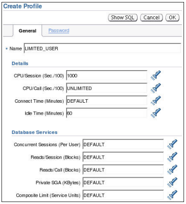

cpu/session :  이 계정이 cpu에 접속한 시간을 10초가 넘어가면 중지함.

cpu/call : 한줄의 명령문이 cpu를 호출한 시간

connect_time : 연결시간 제한

Idle time : 아무것도 안하고 있는시간을 잼.


### 암호 보안 기능 구현

- 암호 복합성 확인
- 계정 Lock
- 암호 aging 및 만료
- 과거 암호 기록

> SYS, SYSMAN, DBSNMP 등 계정을 잠그는 프로파일은 사용하지 않을 것


### 제공된 암호 확인 함수: VERIFY_FUNCTION_11G 

VERIFY_FUNCTION_11G 함수는 암호에 대해 다음을 확인합니다. 

- 8자 이상임 

- Username, Username에 숫자를 붙인 형태, Username을 거꾸로 한 형태가 아님 

- 데이터베이스 이름 또는 데이터베이스 이름에 숫자를 붙인 형태가 아님 

- 최소한 하나의 영문자와 하나의 숫자를 포함하는 문자열임 

- 이전 암호와 최소한 3자 이상이 다름 

>  이 함수를 템플리트로 사용하여 직접 커스터마이즈된 암호 확인 함수를 생성할 수 있습니다.


# 데이터 동시성 관리

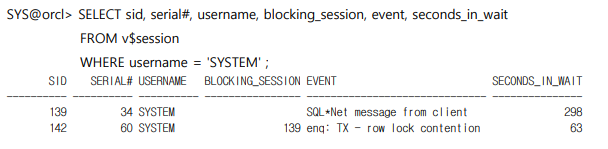

위의 명령어를 통해 waiting 이벤트의 발생 원인과 얼마나 기다렸는지를 알 수 있다.

### lock

- 오라클의 락은 가장 낮은 레벨(한 행)만을 자동으로 걸어준다.
- 높은 레벨의 데이터 동시성을 보장함
  -  낮은 레벨의 한 행만을 락걸기 때문에 같은 테이블에서 동시수정이 가능하다.
- 자동 큐 관리(FIFO)
- ROW EXCLUSIVE(RX) 모드에서는 행을 포함한 테이블에 대한 테이블 락또한 존재한다.(`TM`이라 부른다.)
- 충돌 유발 원인
  - 커밋되지 않은 변경 사항
  - 필요 이상의 높은 LOCK레벨
- 충돌 해결
  1. 트랜잭션을 종료한다(커밋 롤백).
  2. LOCK을 보유하는 세션을 종료시킨다.

- DDL명령어의 경우 DML과는 다르게 WAIT이 발생하지 않고 에러가 발생한다.
  -  ALTER SESSION SET ddl_lock_timeout = 5 ; 

### DEAD LOCK

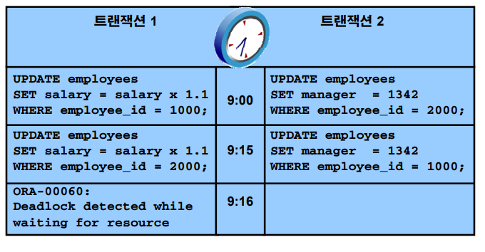

- 두명의 유저가 동시에 웨이팅이 일어날수 있는 작업을 실행시 벌어난다.
- 둘 다 WAIT상태이면 커밋 및 롤백이 불가능하므로 에러를 발생시켜 이를 막는다.
- 이미 대기하던 트랜잭션에서 에러가 뜬다.


```mysql

SELECT session_id, object_id, oracle_username, locked_mode
FROM v$locked_object ;
SESSION_ID OBJECT_ID ORACLE_USERNAME LOCKED_MODE
---------- ---------- ------------------------------ -----------
 139 73181 SYSTEM 3
 142 73181 SYSTEM 3
 
 
SELECT session_id, owner, name, mode_held
FROM dba_dml_locks ;
SESSION_ID OWNER NAME MODE_HELD
---------- ---------- ---------- -------------
 139 SCOTT EMP Row-X (SX)
 142 SCOTT EMP Row-X (SX)
 
 
SELECT sid, serial#, username, blocking_session, event, seconds_in_wait
FROM v$session
WHERE username = 'SYSTEM' ;
SID SERIAL# USERNAME BLOCKING_SESSION EVENT SECONDS_IN_WAIT
---------- ---------- ---------- ---------------- ------------------------------ --------
 139 34 SYSTEM SQL*Net message from client 298
 142 60 SYSTEM 139 enq: TX - row lock contention 63
 


SELECT username, row_wait_obj#, row_wait_file#, row_wait_block#, row_wait_row#, prev_sql_id
FROM v$session
WHERE blocking_session IS NOT NULL ;
USERNAME ROW_WAIT_OBJ# ROW_WAIT_FILE# ROW_WAIT_BLOCK# ROW_WAIT_ROW# PREV_SQL_ID
---------- ------------- -------------- --------------- ------------- -------------
SYSTEM 73181 4 151 8 fzfv0f2pdmnym
SYS@orcl> SELECT owner, object_name
FROM dba_objects
WHERE object_id = 73181 ;
OWNER OBJECT_NAME
---------- ---------------
SCOTT EMP
SYS@orcl> SELECT empno, ename, sal
FROM scott.emp
WHERE rowid = DBMS_ROWID.ROWID_CREATE(1,73181,4,151,8) ;
EMPNO ENAME SAL
---------- ---------- ----------
 7839 KING 5000
SYS@orcl> SELECT sql_text
FROM v$sql
WHERE sql_id = 'fzfv0f2pdmnym' ;
SQL_TEXT
---------------------------------------------------
UPDATE scott.emp SET sal = 6000 WHERE empno = 7839
SYS@orcl> ALTER SYSTEM KILL SESSION '139,34' IMMEDIATE ; 
```


# 10. UNDO DATA

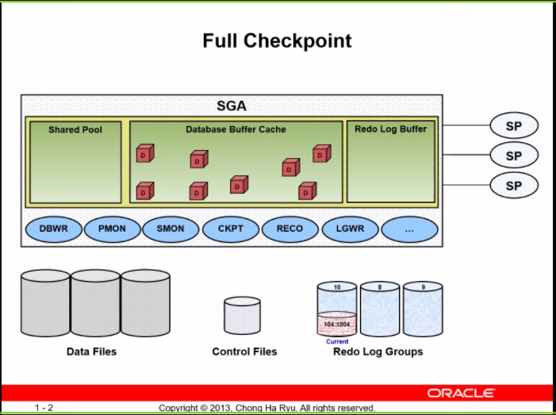

1. 리두로그 버퍼에 변경사항 저장

2. 커밋 명령 실행시 lgwr프로세스에 의해 리두로그 파일로 저장
   - 현재 저장되고 있는 리두로그파일을 CURRENT라고 함
   - 커밋도 리두로그 파일로 저장됨

3. SHUTDOWN 실행
4. FULL CHECKPOINT 실행
   - 모여진 더티 버퍼들을 DBWR들이 DATA FILES들에 저장함.(더티 버퍼는 )
5. CKPT라는 프로세스가 데이터베이스의 컨트롤 파일의 헤더들을 수정하고 버전을 관리함.
6. 모든 동기화가 완료되고 INSTANCE 종료

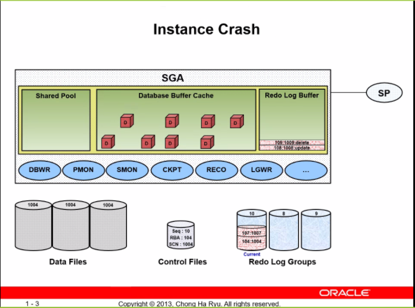

1. STARTUP
2. 컨트롤 파일에서 모든 위치정보들을 읽음
3. SMON프로세스가 확인작업을 진행(과거의 SHUTDOWN이 비정상종료라면 다른 부분을 감지).
4. 갑자기 인스턴스가 비정상 종료
   - 이를 Inconsistent Database(Dirty Database)라고 함.

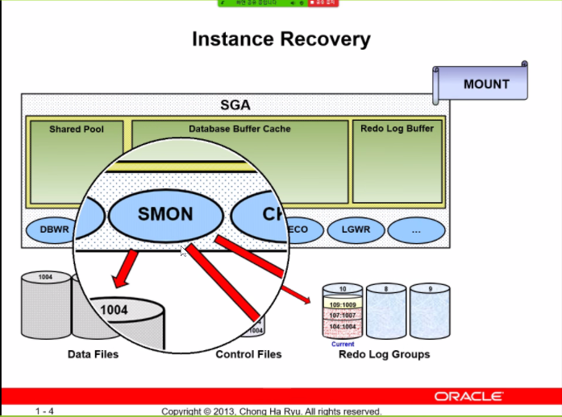

1. STARTUP
2. 컨트롤 파일에서 모든 위치정보들을 읽음
3. SMON프로세스가 확인작업을 진행(과거의 SHUTDOWN이 비정상종료라면 다른 부분을 감지).
4. SMON이 REDO LOG FILE을 읽고 Rolling Foward를 실행함
   - Rolling Foward 는 리두로그파일을 읽고 데이터 버퍼 캐쉬에 다시 더티버퍼들을 다시 올려주는 작업.
   - 다만 모든 리두로그(커밋 안된 파일이 들어있을 수 있음)를 더티버퍼 생성
5. ROLLBACK을 실행(마지막 커밋이후에 쌓여진 리두로그데이터는 롤백당함.)


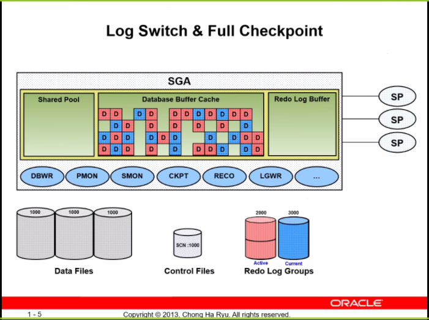

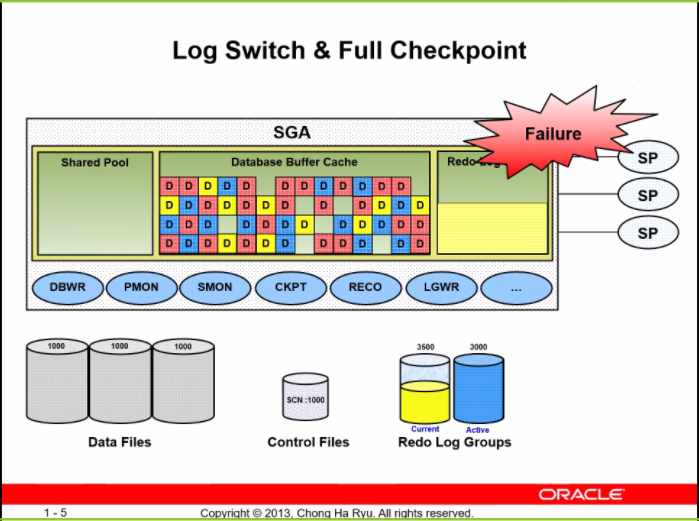

1. SHUTDOWN(FULL CHECKPOINT) 이 진행되기전에 리두가 너무 많이 쌓인다면 빨간색 리두로그파일은 날아가 버린다?


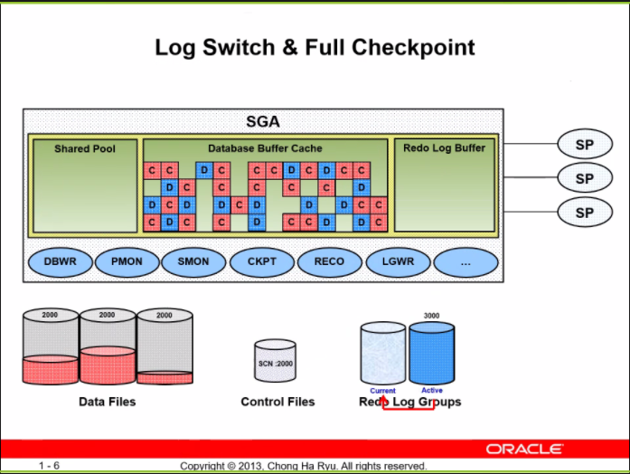

1. Log 데이터파일이 꽉차면 LOG Switch라는 이벤트가 발생되고(FULL CHECKPOINT)가 실행된다.
2. DBWR 프로세스가 더티버퍼를 데이타파일에 덮어쓴다.
3. 더티버퍼들은 클린버퍼가 된다.(데이터파일과 버퍼의 상태가 같기 때문에)
4. 중간 저장이라고 생각하면 될듯 


### OTHER CASE

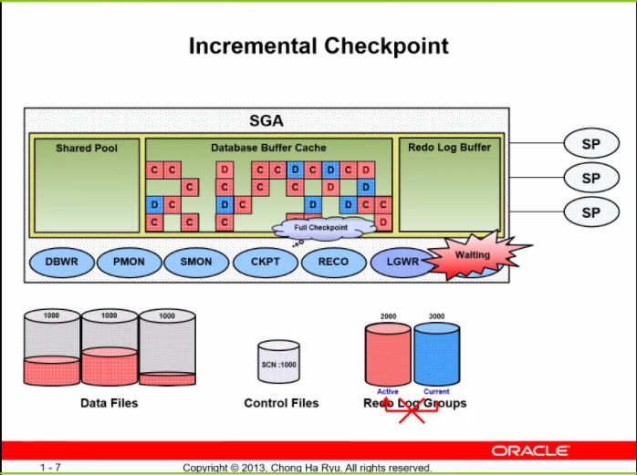

만약 아직 더티버퍼를 데이터에 내려받는 작업 도중에 로그 스위치가 진행되어야 한다면 

- 로그 스위치가 일어날 수 없다. 
- 또한 커밋도 일어날 수 없다.

해결방법

- **Incremental Checkpoint**를 진행한다.
  - 평소에 찔끔 찔끔 저장한다.

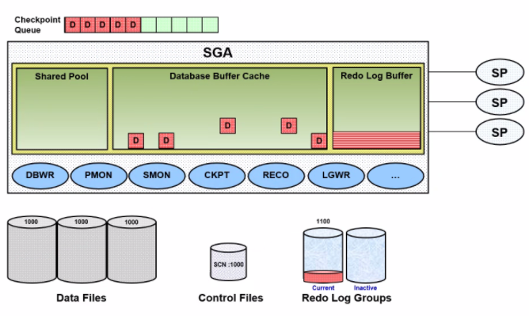

사실은 Checkpoint Queue라는 큐에 더티 버퍼의 주소와 내용을 저장하고 있다가 일정 수치를 넘어쌓이면 내려쓰기를 시작한다.

항상 LGWR이 DBWR보다 먼저 실행된다.


결론

Full Checkpoint가 실행되는 시점 : SHUTDOWN, 로그 스위치

Incremental Checkpoint가 실행되는 시점: 평소 Checkpoint Queue에 일정 수치가 넘어가면 작업시작 


논외

1. 데이터 버퍼 캐쉬와 언두데이터를 준비한다.
2. 락을 건다.
3. 리두로그버퍼에 작업을 저장한다.
4. 데이터 버퍼의 데이터를 수정한다.
5. 커밋을 하지 않은 데이터도 모두 내려쓴다.
6. 리두로그파일과 데이터 버퍼와의 일관성을 유지하기 위해서.
7. undodata의 파일이 달라지는 것도 dirty buffer이며 롤백시 이를 이용하기 때문에 데이터 버퍼캐시와 일원화작업이라고 보면 되려나.s