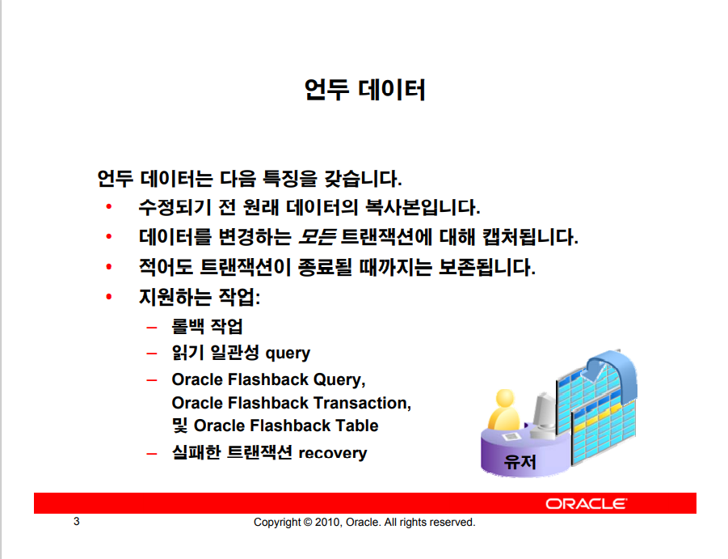
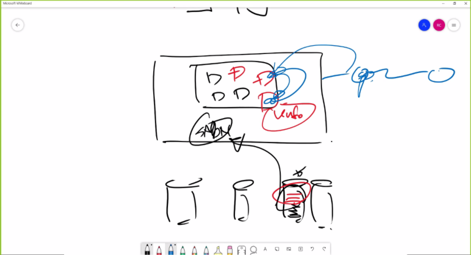
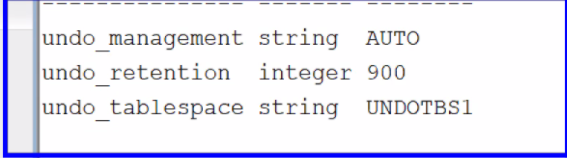
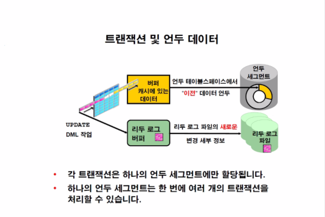
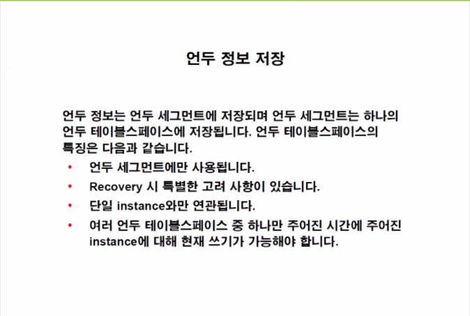
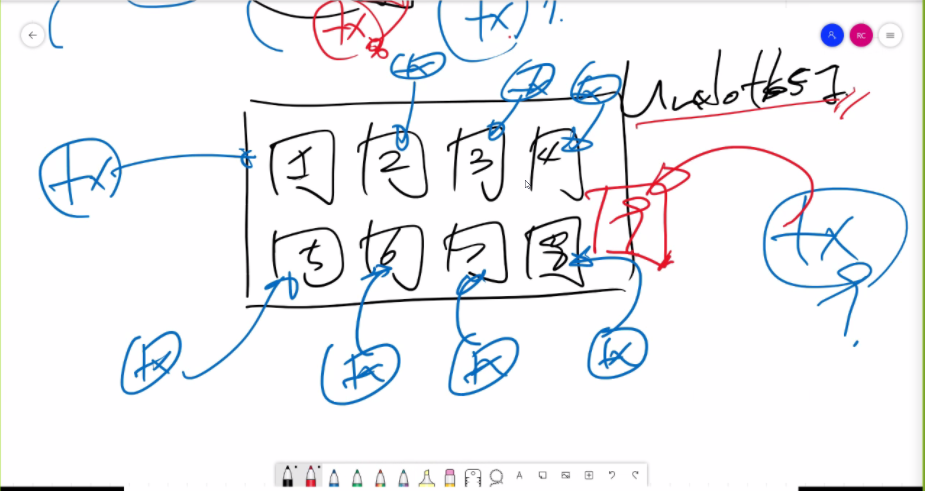
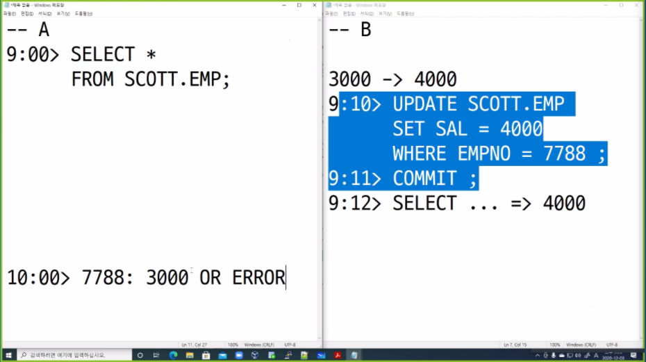
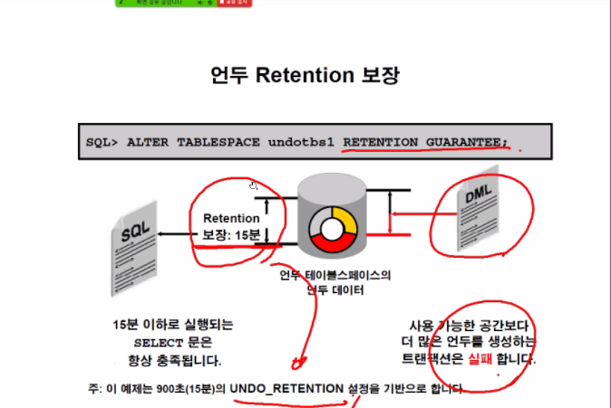
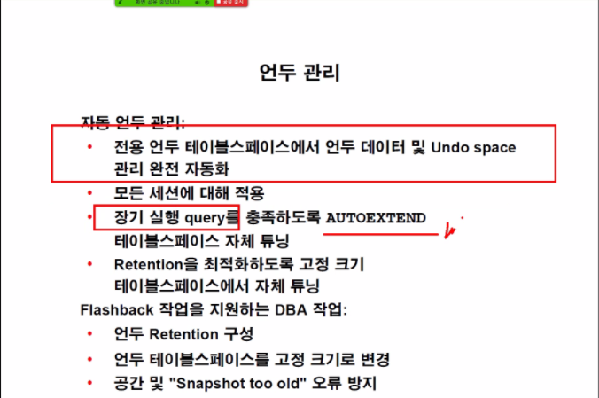

# 10.UNDO DATA 관리

메모리는 한정적 자원이기 때문에 UNDO 데이터 파일과 undo TBS가 존재하고 관리한다.

UPDATE의 언두 데이터는 예전의 값을 저장된다.

INSERT의 언두 데이터는 ROW_ID만이 저장되어있다.

SELECT를 제외한 DDL, DML, REVOKE, GRANT 등 모든 작업은 UNDO데이터를 생성하면서 실행된다.

- 실패한 트랜잭션 RECOVERY

트랜잭션이 날아가고 커밋되지 않은 리두로그 데이터는 다시 SMON에 의해 재실행되며 UNDO데이터를 재생산 하는데 이를 이용하여 다른 유저가 접근시 UNDO데이터로 롤백한 이미지들을 보여준다.

UNDO 데이터는 15분은 저장되기 때문에 딜리트 후 커밋되어 사라진 데이터도 복구가 가능은하다.

- 언두데이터는 세그먼트 단위로 관리한다.
  - 한 트랜잭션은 하나의 언두 세그먼트를 가진다.
  - 하지만 하나의 언두 세그먼트는 트랜잭션이 여러개 일 수 있다.

이는 다른 테이블 스페이스와 공유되지 않는 언두 테이블 스페이스에 저장된다.

언두 테이블 스페이스는 여러개를 지니고 있더라도 하나만이 사용된다.

### 참조

9i버젼부터 자동으로 세그먼트를 Oracle이 생성을 해준다(이전에는 DBA가 직접 생성했음.)

### 언두관리

- 퀴즈

### 

셀렉트 쿼리를 날린 시점에서의 결과 혹은 에러가 나오게 된다.

이러한 에러를 피하기 위해 UNDO DATA의 관리를 (UNDO RETENTION 확장)해줘야 한다.

> 에러가 나오는 이유 참조해야할 언두데이터가 B사용자가 커밋을 하여 ORACLE이 삭제해버린경우
>
> 참조할 주소가 없어 `Snapshot too old ERROR`가 뜬다.

이러한 사항을 막기위해 언두 관리가 필요하다.

- 장기 실행 query를 충족하도록 Autoextend를 실행하면 공간낭비가 너무심하다. 
- Oracle의 자체 튜닝 기능이 있다.

