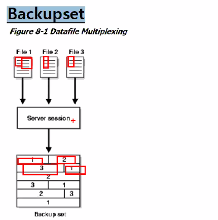
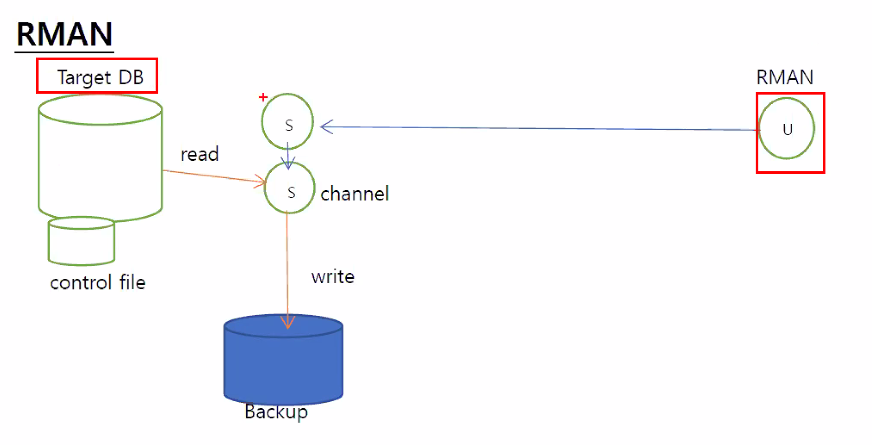

- backup Block은 여러 시점의 data를 지니므로  block레벨의 로그 생성이 필요함.

- Backup Mode는 관련 data file에 log를 기억하므로 필요하다.

  

- backup set 방식

  - 하나의 데이터 파일을 읽는다면 disk i/o작업이 너무 많이 일어나기 때문에 사용자가 data file을 접근하는데 어려움이 잇음.
  - 따라서 스트리밍 방식으로 3개의 파일을 동시 다발적으로 저장함
  - 하지만 이 3개의 데이터 파일을 다 저장하는건 OS적 한계로 backup파일이 너무 커지기 때문에 Backup Piece형식으로 나눠 저장함.(.alz1, .alz2 저장하듯)
  - 할당이 되어있는 블록만 백업함.(미리 잡아놓은 공간을 저장하지는 않기 때문에 파일 용량이 줄어든다.)
  - High Water Mark(데이터가 실제 저장되어있음을 표기함) 이상 블럭은 백업하지 않음
  - compressed backupset이 가능(압축 백업.)

  - 가장 큰 장점 : 백업파일의 크기가 작음
  - 단점 : 리커버리의 시간이 오래걸림(file2와 file3이 뒤죽박죽 섞여있기 때문)

# RMAN(recovery Manager)

- channel process는 disk i/o작업을 전담하는 RMAN의 slave process이다.
- RMAN의 모든 작업은 RMAN process가 control file이 기록 저장함. (overwriting방식으로 컨트롤 파일이 무기한으로 커지는걸 방지)
  - control_file_record_keep_time 파라미터에 설정된 기간(디폴트는 7일)동안 저장함.