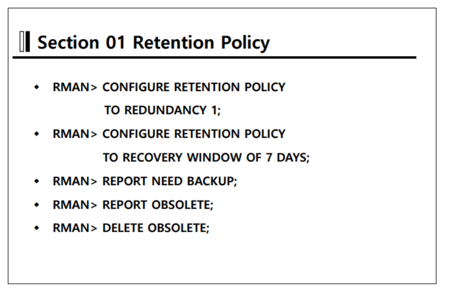
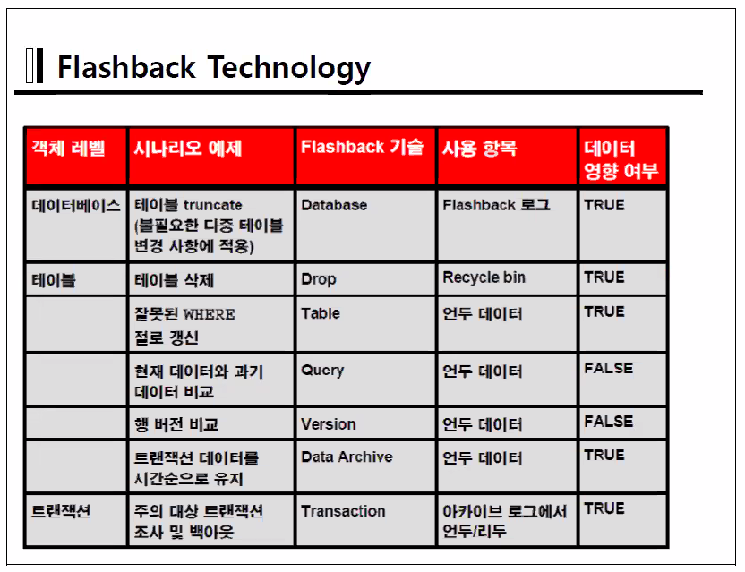

시나리오 5_4 5_7 7_7 업데이트


### Data Recovery Advisor


##### 10g 버전에서 critical error를 확인 하는 법.

- `background_dump_dest` 
  - `alert_orcl1.log`, `*.trc`두 파일에 dbwr이 작업하면서 만난 오류들이 적혀있다.

- `user_dump_dest`
  - user(sql) trace file을 확인 할 수 있다.


##### 11g file system

- block critical이 일어났을 때 이 사건을 incident라 한다. incident 폴더에 정보들이 저장됨
- hm은 health monitor의 약자로 db의 운용상태 점검 데이터를 저장한다.
- `Alert`라는 경로에는 .xml 파일로 저장이 되며 10g 버젼에서 사용되던 텍스트 파일들은 `Trace` 폴더에 저장된다.

- ADR경로의 파일들을 쉽게 조회하기 위해 ADRCI라는 유틸리티를 제공한다.


##### ADRCI

- `show alert`
- `show incident`


V$DIAG_INFO 

- ADR의 사용유무 log의 저장 경로등을 확인 할 수 있다.


5-10 시나리오

```sqlite
====================================================================================
Archived Log Mode에서 데이터화일 손상시 Data Recovery Advisor를 이용한 완전 복구
====================================================================================

/*
   장애 환경 준비
*/

[orcl1:~]$ sqlplus / as sysdba


SQL> create tablespace insa_tbs
  2  datafile '/u01/app/oracle/oradata/orcl1/insa_tbs01.dbf' size 10m;

Tablespace created.

SQL> set linesize 300
SQL> col file_name format a50
SQL> select tablespace_name, bytes/1024/1024 MB, file_name, online_status
  2  from dba_data_files;

TABLESPACE_NAME                        MB FILE_NAME                                          ONLINE_
------------------------------ ---------- -------------------------------------------------- -------
USERS                                   5 /u01/app/oracle/oradata/orcl1/users01.dbf          ONLINE
UNDOTBS1                               90 /u01/app/oracle/oradata/orcl1/undotbs01.dbf        ONLINE
SYSAUX                                490 /u01/app/oracle/oradata/orcl1/sysaux01.dbf         ONLINE
SYSTEM                                680 /u01/app/oracle/oradata/orcl1/system01.dbf         SYSTEM
EXAMPLE                               100 /u01/app/oracle/oradata/orcl1/example01.dbf        ONLINE
INSA_TBS                               10 /u01/app/oracle/oradata/orcl1/insa_tbs01.dbf       ONLINE

6 rows selected.

SQL> 


[orcl1:~]$ rman target /

Recovery Manager: Release 11.2.0.1.0 - Production on Sun Jan 3 21:20:40 2021

Copyright (c) 1982, 2009, Oracle and/or its affiliates.  All rights reserved.

connected to target database: ORCL1 (DBID=1445091359)

RMAN> report schema;

using target database control file instead of recovery catalog
Report of database schema for database with db_unique_name ORCL1

List of Permanent Datafiles
===========================
File Size(MB) Tablespace           RB segs Datafile Name
---- -------- -------------------- ------- ------------------------
1    680      SYSTEM               ***     /u01/app/oracle/oradata/orcl1/system01.dbf
2    490      SYSAUX               ***     /u01/app/oracle/oradata/orcl1/sysaux01.dbf
3    90       UNDOTBS1             ***     /u01/app/oracle/oradata/orcl1/undotbs01.dbf
4    5        USERS                ***     /u01/app/oracle/oradata/orcl1/users01.dbf
5    100      EXAMPLE              ***     /u01/app/oracle/oradata/orcl1/example01.dbf
6    10       INSA_TBS             ***     /u01/app/oracle/oradata/orcl1/insa_tbs01.dbf

List of Temporary Files
=======================
File Size(MB) Tablespace           Maxsize(MB) Tempfile Name
---- -------- -------------------- ----------- --------------------
1    29       TEMP                 32767       /u01/app/oracle/oradata/orcl1/temp01.dbf


RMAN> 

RMAN> report need backup;

RMAN retention policy will be applied to the command
RMAN retention policy is set to redundancy 1
Report of files with less than 1 redundant backups
File #bkps Name
---- ----- -----------------------------------------------------
6    0     /u01/app/oracle/oradata/orcl1/insa_tbs01.dbf

/*
   복구를 위한 백업
*/

RMAN> backup tablespace insa_tbs format '/home/oracle/BACKUP/%U_%T';

Starting backup at 2021-01-03:21:23:19
allocated channel: ORA_DISK_1
channel ORA_DISK_1: SID=146 device type=DISK
channel ORA_DISK_1: starting full datafile backup set
channel ORA_DISK_1: specifying datafile(s) in backup set
input datafile file number=00006 name=/u01/app/oracle/oradata/orcl1/insa_tbs01.dbf
channel ORA_DISK_1: starting piece 1 at 2021-01-03:21:23:19
channel ORA_DISK_1: finished piece 1 at 2021-01-03:21:23:20
piece handle=/home/oracle/BACKUP/0lvjnve7_1_1_20210103 tag=TAG20210103T212319 comment=NONE
channel ORA_DISK_1: backup set complete, elapsed time: 00:00:01
Finished backup at 2021-01-03:21:23:20

Starting Control File and SPFILE Autobackup at 2021-01-03:21:23:20
piece handle=/u01/app/oracle/flash_recovery_area/ORCL1/autobackup/2021_01_03/o1_mf_s_1060896200_hz3fsrjj_.bkp comment=NONE
Finished Control File and SPFILE Autobackup at 2021-01-03:21:23:21


RMAN> report need backup;

RMAN retention policy will be applied to the command
RMAN retention policy is set to redundancy 1
Report of files with less than 1 redundant backups
File #bkps Name
---- ----- -----------------------------------------------------


RMAN> list backup;


List of Backup Sets
===================


BS Key  Type LV Size       Device Type Elapsed Time Completion Time    
------- ---- -- ---------- ----------- ------------ -------------------
1       Full    275.85M    DISK        00:00:40     2021-01-02:11:58:10
        BP Key: 1   Status: AVAILABLE  Compressed: YES  Tag: TAG20210102T115730
        Piece Name: /home/oracle/backup/rman/02vjk9ta_1_1_20210102
  List of Datafiles in backup set 1
  File LV Type Ckp SCN    Ckp Time            Name
  ---- -- ---- ---------- ------------------- ----
  1       Full 849796     2021-01-02:11:57:30 /u01/app/oracle/oradata/orcl1/system01.dbf
  2       Full 849796     2021-01-02:11:57:30 /u01/app/oracle/oradata/orcl1/sysaux01.dbf
  3       Full 849796     2021-01-02:11:57:30 /u01/app/oracle/oradata/orcl1/undotbs01.dbf
  4       Full 849796     2021-01-02:11:57:30 /u01/app/oracle/oradata/orcl1/users01.dbf
  5       Full 849796     2021-01-02:11:57:30 /u01/app/oracle/oradata/orcl1/example01.dbf

BS Key  Type LV Size       Device Type Elapsed Time Completion Time    
------- ---- -- ---------- ----------- ------------ -------------------
2       Full    9.36M      DISK        00:00:00     2021-01-02:11:58:15
        BP Key: 2   Status: AVAILABLE  Compressed: NO  Tag: TAG20210102T115815
        Piece Name: /u01/app/oracle/flash_recovery_area/ORCL1/autobackup/2021_01_02/o1_mf_s_1060775895_hyzrb7t6_.bkp
  SPFILE Included: Modification time: 2021-01-02:11:57:21
  SPFILE db_unique_name: ORCL1
  Control File Included: Ckp SCN: 849819       Ckp time: 2021-01-02:11:58:15

BS Key  Type LV Size       Device Type Elapsed Time Completion Time    
------- ---- -- ---------- ----------- ------------ -------------------
3       Full    275.94M    DISK        00:00:42     2021-01-03:13:44:50
        BP Key: 3   Status: AVAILABLE  Compressed: YES  Tag: TAG20210103T134407
        Piece Name: /home/oracle/backup/rman/04vjn4h8_1_1_20210103
  List of Datafiles in backup set 3
  File LV Type Ckp SCN    Ckp Time            Name
  ---- -- ---- ---------- ------------------- ----
  1       Full 860262     2021-01-03:13:44:08 /u01/app/oracle/oradata/orcl1/system01.dbf
  2       Full 860262     2021-01-03:13:44:08 /u01/app/oracle/oradata/orcl1/sysaux01.dbf
  3       Full 860262     2021-01-03:13:44:08 /u01/app/oracle/oradata/orcl1/undotbs01.dbf
  4       Full 860262     2021-01-03:13:44:08 /u01/app/oracle/oradata/orcl1/users01.dbf
  5       Full 860262     2021-01-03:13:44:08 /u01/app/oracle/oradata/orcl1/example01.dbf

BS Key  Type LV Size       Device Type Elapsed Time Completion Time    
------- ---- -- ---------- ----------- ------------ -------------------
4       Full    9.36M      DISK        00:00:00     2021-01-03:13:44:53
        BP Key: 4   Status: AVAILABLE  Compressed: NO  Tag: TAG20210103T134453
        Piece Name: /u01/app/oracle/flash_recovery_area/ORCL1/autobackup/2021_01_03/o1_mf_s_1060868693_hz2ly595_.bkp
  SPFILE Included: Modification time: 2021-01-03:13:40:24
  SPFILE db_unique_name: ORCL1
  Control File Included: Ckp SCN: 860283       Ckp time: 2021-01-03:13:44:53

BS Key  Type LV Size       Device Type Elapsed Time Completion Time    
------- ---- -- ---------- ----------- ------------ -------------------
5       Full    9.42M      DISK        00:00:00     2021-01-03:14:03:28
        BP Key: 5   Status: AVAILABLE  Compressed: NO  Tag: TAG20210103T140328
        Piece Name: /u01/app/oracle/flash_recovery_area/ORCL1/autobackup/2021_01_03/o1_mf_s_1060869808_hz2n10nx_.bkp
  SPFILE Included: Modification time: 2021-01-03:13:58:08
  SPFILE db_unique_name: ORCL1
  Control File Included: Ckp SCN: 860665       Ckp time: 2021-01-03:14:03:28

BS Key  Type LV Size       Device Type Elapsed Time Completion Time    
------- ---- -- ---------- ----------- ------------ -------------------
6       Full    275.98M    DISK        00:00:41     2021-01-03:14:06:31
        BP Key: 6   Status: AVAILABLE  Compressed: YES  Tag: TAG20210103T140549
        Piece Name: /home/oracle/backup/rman/07vjn5pu_1_1_20210103
  List of Datafiles in backup set 6
  File LV Type Ckp SCN    Ckp Time            Name
  ---- -- ---- ---------- ------------------- ----
  1       Full 860749     2021-01-03:14:05:50 /u01/app/oracle/oradata/orcl1/system01.dbf
  2       Full 860749     2021-01-03:14:05:50 /u01/app/oracle/oradata/orcl1/sysaux01.dbf
  3       Full 860749     2021-01-03:14:05:50 /u01/app/oracle/oradata/orcl1/undotbs01.dbf
  4       Full 860749     2021-01-03:14:05:50 /u01/app/oracle/oradata/orcl1/users01.dbf
  5       Full 860749     2021-01-03:14:05:50 /u01/app/oracle/oradata/orcl1/example01.dbf

BS Key  Type LV Size       Device Type Elapsed Time Completion Time    
------- ---- -- ---------- ----------- ------------ -------------------
7       Full    9.42M      DISK        00:00:02     2021-01-03:14:06:37
        BP Key: 7   Status: AVAILABLE  Compressed: NO  Tag: TAG20210103T140635
        Piece Name: /u01/app/oracle/flash_recovery_area/ORCL1/autobackup/2021_01_03/o1_mf_s_1060869995_hz2n6wdl_.bkp
  SPFILE Included: Modification time: 2021-01-03:13:58:08
  SPFILE db_unique_name: ORCL1
  Control File Included: Ckp SCN: 860770       Ckp time: 2021-01-03:14:06:35

BS Key  Type LV Size       Device Type Elapsed Time Completion Time    
------- ---- -- ---------- ----------- ------------ -------------------
8       Full    274.10M    DISK        00:00:41     2021-01-03:15:12:47
        BP Key: 8   Status: AVAILABLE  Compressed: YES  Tag: TAG20210103T151206
        Piece Name: /home/oracle/backup/rman/09vjn9m6_1_1_20210103
  List of Datafiles in backup set 8
  File LV Type Ckp SCN    Ckp Time            Name
  ---- -- ---- ---------- ------------------- ----
  1       Full 863417     2021-01-03:15:12:06 /u01/app/oracle/oradata/orcl1/system01.dbf
  2       Full 863417     2021-01-03:15:12:06 /u01/app/oracle/oradata/orcl1/sysaux01.dbf
  3       Full 863417     2021-01-03:15:12:06 /u01/app/oracle/oradata/orcl1/undotbs01.dbf
  4       Full 863417     2021-01-03:15:12:06 /u01/app/oracle/oradata/orcl1/users01.dbf
  5       Full 863417     2021-01-03:15:12:06 /u01/app/oracle/oradata/orcl1/example01.dbf
  6       Full 863417     2021-01-03:15:12:06 

BS Key  Type LV Size       Device Type Elapsed Time Completion Time    
------- ---- -- ---------- ----------- ------------ -------------------
9       Full    9.42M      DISK        00:00:00     2021-01-03:15:47:20
        BP Key: 9   Status: AVAILABLE  Compressed: NO  Tag: TAG20210103T154720
        Piece Name: /u01/app/oracle/flash_recovery_area/ORCL1/autobackup/2021_01_03/o1_mf_s_1060876040_hz2t3rkl_.bkp
  SPFILE Included: Modification time: 2021-01-03:15:47:03
  SPFILE db_unique_name: ORCL1
  Control File Included: Ckp SCN: 863804       Ckp time: 2021-01-03:15:47:20

BS Key  Type LV Size       Device Type Elapsed Time Completion Time    
------- ---- -- ---------- ----------- ------------ -------------------
10      Full    274.32M    DISK        00:00:56     2021-01-03:15:49:56
        BP Key: 10   Status: AVAILABLE  Compressed: YES  Tag: TAG20210103T154900
        Piece Name: /home/oracle/backup/rman/0dvjnbrc_1_1_20210103
  List of Datafiles in backup set 10
  File LV Type Ckp SCN    Ckp Time            Name
  ---- -- ---- ---------- ------------------- ----
  1       Full 863891     2021-01-03:15:49:00 /u01/app/oracle/oradata/orcl1/system01.dbf
  2       Full 863891     2021-01-03:15:49:00 /u01/app/oracle/oradata/orcl1/sysaux01.dbf
  3       Full 863891     2021-01-03:15:49:00 /u01/app/oracle/oradata/orcl1/undotbs01.dbf
  4       Full 863891     2021-01-03:15:49:00 /u01/app/oracle/oradata/orcl1/users01.dbf
  5       Full 863891     2021-01-03:15:49:00 /u01/app/oracle/oradata/orcl1/example01.dbf
  6       Full 863891     2021-01-03:15:49:00 

BS Key  Type LV Size       Device Type Elapsed Time Completion Time    
------- ---- -- ---------- ----------- ------------ -------------------
11      Full    9.42M      DISK        00:00:00     2021-01-03:15:50:05
        BP Key: 11   Status: AVAILABLE  Compressed: NO  Tag: TAG20210103T155005
        Piece Name: /u01/app/oracle/flash_recovery_area/ORCL1/autobackup/2021_01_03/o1_mf_s_1060876205_hz2t8xps_.bkp
  SPFILE Included: Modification time: 2021-01-03:15:47:03
  SPFILE db_unique_name: ORCL1
  Control File Included: Ckp SCN: 863921       Ckp time: 2021-01-03:15:50:05

BS Key  Type LV Size       Device Type Elapsed Time Completion Time    
------- ---- -- ---------- ----------- ------------ -------------------
12      Full    9.42M      DISK        00:00:00     2021-01-03:20:40:12
        BP Key: 12   Status: AVAILABLE  Compressed: NO  Tag: TAG20210103T204012
        Piece Name: /u01/app/oracle/flash_recovery_area/ORCL1/autobackup/2021_01_03/o1_mf_s_1060893612_hz3c8whx_.bkp
  SPFILE Included: Modification time: 2021-01-03:15:47:03
  SPFILE db_unique_name: ORCL1
  Control File Included: Ckp SCN: 870071       Ckp time: 2021-01-03:20:40:12

BS Key  Type LV Size       Device Type Elapsed Time Completion Time    
------- ---- -- ---------- ----------- ------------ -------------------
13      Full    1.03M      DISK        00:00:00     2021-01-03:21:23:19
        BP Key: 13   Status: AVAILABLE  Compressed: NO  Tag: TAG20210103T212319
        Piece Name: /home/oracle/BACKUP/0lvjnve7_1_1_20210103
  List of Datafiles in backup set 13
  File LV Type Ckp SCN    Ckp Time            Name
  ---- -- ---- ---------- ------------------- ----
  6       Full 872077     2021-01-03:21:23:19 /u01/app/oracle/oradata/orcl1/insa_tbs01.dbf

BS Key  Type LV Size       Device Type Elapsed Time Completion Time    
------- ---- -- ---------- ----------- ------------ -------------------
14      Full    9.42M      DISK        00:00:00     2021-01-03:21:23:20
        BP Key: 14   Status: AVAILABLE  Compressed: NO  Tag: TAG20210103T212320
        Piece Name: /u01/app/oracle/flash_recovery_area/ORCL1/autobackup/2021_01_03/o1_mf_s_1060896200_hz3fsrjj_.bkp
  SPFILE Included: Modification time: 2021-01-03:21:07:26
  SPFILE db_unique_name: ORCL1
  Control File Included: Ckp SCN: 872084       Ckp time: 2021-01-03:21:23:20


SQL> create table hr.insa_table   
  2  tablespace insa_tbs
  3  as select * from hr.employees;

Table created.

SQL> select count(*) from hr.insa_table;

  COUNT(*)
----------
       107


SQL> 
SQL> select * from v$log;

    GROUP#    THREAD#  SEQUENCE#      BYTES  BLOCKSIZE    MEMBERS ARC STATUS           FIRST_CHANGE# FIRST_TIME    NEXT_CHANGE# NEXT_TIME
---------- ---------- ---------- ---------- ---------- ---------- --- ---------------- ------------- ------------------- ------------ -------------------
         1          1          4   52428800        512          2 NO  CURRENT                 871654 2021-01-03:21:18:08   2.8147E+14
         2          1          2   52428800        512          2 YES INACTIVE                864021 2021-01-03:15:54:18       871651 2021-01-03:21:18:07
         3          1          3   52428800        512          2 YES INACTIVE                871651 2021-01-03:21:18:07       871654 2021-01-03:21:18:08


/*
   장애 발생
*/

SQL> !rm /u01/app/oracle/oradata/orcl1/insa_tbs01.dbf

SQL> !ls /u01/app/oracle/oradata/orcl1/insa_tbs01.dbf
ls: /u01/app/oracle/oradata/orcl1/insa_tbs01.dbf: No such file or directory


SQL> conn / as sysdba
Connected.
SQL> alter system flush buffer_cache;

System altered.

SQL> select * from hr.insa_table;
select * from hr.insa_table
                 *
ERROR at line 1:
ORA-01116: error in opening database file 6
ORA-01110: data file 6: '/u01/app/oracle/oradata/orcl1/insa_tbs01.dbf'
ORA-27041: unable to open file
Linux Error: 2: No such file or directory
Additional information: 3


/*
   Data Recovery Advisor를 통해 장애 원인을 알아냄
*/

RMAN> list failure;

List of Database Failures
=========================

Failure ID Priority Status    Time Detected       Summary
---------- -------- --------- ------------------- -------
102        HIGH     OPEN      2021-01-03:13:54:50 One or more non-system datafiles are missing

RMAN> list failure 102 detail;

List of Database Failures
=========================

Failure ID Priority Status    Time Detected       Summary
---------- -------- --------- ------------------- -------
102        HIGH     OPEN      2021-01-03:13:54:50 One or more non-system datafiles are missing
  Impact: See impact for individual child failures
  List of child failures for parent failure ID 102
  Failure ID Priority Status    Time Detected       Summary
  ---------- -------- --------- ------------------- -------
  535        HIGH     OPEN      2021-01-03:15:38:25 Datafile 6: '/u01/app/oracle/oradata/orcl1/insa_tbs01.dbf' is missing
    Impact: Some objects in tablespace INSA_TBS might be unavailable


/* 
   복구를 위한 Advise
*/

RMAN> advise failure;

List of Database Failures
=========================

Failure ID Priority Status    Time Detected       Summary
---------- -------- --------- ------------------- -------
102        HIGH     OPEN      2021-01-03:13:54:50 One or more non-system datafiles are missing
  Impact: See impact for individual child failures
  List of child failures for parent failure ID 102
  Failure ID Priority Status    Time Detected       Summary
  ---------- -------- --------- ------------------- -------
  535        HIGH     OPEN      2021-01-03:15:38:25 Datafile 6: '/u01/app/oracle/oradata/orcl1/insa_tbs01.dbf' is missing
    Impact: Some objects in tablespace INSA_TBS might be unavailable

analyzing automatic repair options; this may take some time
using channel ORA_DISK_1
analyzing automatic repair options complete

Mandatory Manual Actions
========================
no manual actions available

Optional Manual Actions
=======================
1. If file /u01/app/oracle/oradata/orcl1/insa_tbs01.dbf was unintentionally renamed or moved, restore it

Automated Repair Options
========================
Option Repair Description
------ ------------------
1      Restore and recover datafile 6  
  Strategy: The repair includes complete media recovery with no data loss
  Repair script: /u01/app/oracle/diag/rdbms/orcl1/orcl1/hm/reco_2152883867.hm


/* 
   작성된 rman script를 확인하고 수행
*/

RMAN> repair failure preview;

Strategy: The repair includes complete media recovery with no data loss
Repair script: /u01/app/oracle/diag/rdbms/orcl1/orcl1/hm/reco_2152883867.hm

contents of repair script:
   # restore and recover datafile
   sql 'alter database datafile 6 offline';
   restore datafile 6;
   recover datafile 6;
   sql 'alter database datafile 6 online';


RMAN> repair failure;

Strategy: The repair includes complete media recovery with no data loss
Repair script: /u01/app/oracle/diag/rdbms/orcl1/orcl1/hm/reco_2152883867.hm

contents of repair script:
   # restore and recover datafile
   sql 'alter database datafile 6 offline';
   restore datafile 6;
   recover datafile 6;
   sql 'alter database datafile 6 online';

Do you really want to execute the above repair (enter YES or NO)? yes
executing repair script

sql statement: alter database datafile 6 offline

Starting restore at 2021-01-03:21:32:36
using channel ORA_DISK_1

channel ORA_DISK_1: starting datafile backup set restore
channel ORA_DISK_1: specifying datafile(s) to restore from backup set
channel ORA_DISK_1: restoring datafile 00006 to /u01/app/oracle/oradata/orcl1/insa_tbs01.dbf
channel ORA_DISK_1: reading from backup piece /home/oracle/BACKUP/0lvjnve7_1_1_20210103
channel ORA_DISK_1: piece handle=/home/oracle/BACKUP/0lvjnve7_1_1_20210103 tag=TAG20210103T212319
channel ORA_DISK_1: restored backup piece 1
channel ORA_DISK_1: restore complete, elapsed time: 00:00:01
Finished restore at 2021-01-03:21:32:37

Starting recover at 2021-01-03:21:32:37
using channel ORA_DISK_1

starting media recovery
media recovery complete, elapsed time: 00:00:00

Finished recover at 2021-01-03:21:32:37

sql statement: alter database datafile 6 online
repair failure complete


/* 
   완전 복구 확인
*/

SQL> select count(*) from hr.insa_table;

  COUNT(*)
----------
       107


/*
   복구 완료 후 실습에 사용한 환경을 삭제
*/

SQL> drop tablespace insa_tbs including contents and datafiles;

Tablespace dropped.
```

##### `list failure`

- 에러의 원인을 줄글로 알려줌

`advise failure`

- 어떠한 조치를 취해야 할 수 있는지 충고해줌

`repair failure preview`

- repair시 어떠한 방식을 진행할지 보여줌

`repair failure`

- 오라클이 추천하는 방식으로 문제를 해결함.

> list failure 는 ADR에 수집된 정보를 기준으로 충고를 내려주므로 충분히 로그가 수집이 되어있지 않다면 충고를 해주지 않을 수도 있다.


5-7 시나리오

아카이브 파일이 없어져 불완전 복구가 필요한 경우에는 list failure 로 시작하는 저 기능들을 사용할 수 없다. 


# RMAN관리



`configure Retention POlicy to redundancy 1`

`configure Retention POlicy to recovery window of 7 days`

`report need backup`

- 필요한 백업을 rman이 분석해준다.ㅎㅎ

`report obsolute`

`delete obsolute`


### Cross Check


- cross check는 아카이브 로그와 백업의 버전이 잘못되지는 않았는지(expire상태) 체크한다.
- 컨트롤 파일에 저장되어있는 백업정보를 관리한다.

- FRA는 FastRecoveryArea의 관리는 Rman이 해준다.
- Rman이 잘못된 판단으로 인해 데이터가 넘쳐 로그스위치가 제대로 안일어나는 것을 방지해준다.


6-1 시나리오

```sqlite
/*
현재 control file이 가진 backup 정보와
실제로 backup된 file간의 정보가 일치하는지 비교 확인.
비교해봐서 일치하지 않는 backupset 정보는 삭제.
*/


[orcl1:~]$ rman target /


RMAN> report schema;

using target database control file instead of recovery catalog
Report of database schema for database with db_unique_name ORCL1

List of Permanent Datafiles
===========================
File Size(MB) Tablespace           RB segs Datafile Name
---- -------- -------------------- ------- ------------------------
1    680      SYSTEM               ***     /u01/app/oracle/oradata/orcl1/system01.dbf
2    490      SYSAUX               ***     /u01/app/oracle/oradata/orcl1/sysaux01.dbf
3    90       UNDOTBS1             ***     /u01/app/oracle/oradata/orcl1/undotbs01.dbf
4    5        USERS                ***     /u01/app/oracle/oradata/orcl1/users01.dbf
5    100      EXAMPLE              ***     /u01/app/oracle/oradata/orcl1/example01.dbf

List of Temporary Files
=======================
File Size(MB) Tablespace           Maxsize(MB) Tempfile Name
---- -------- -------------------- ----------- --------------------
1    29       TEMP                 32767       /u01/app/oracle/oradata/orcl1/temp01.dbf


RMAN> backup datafile 4;

Starting backup at 2021-01-03:21:42:42
allocated channel: ORA_DISK_1
channel ORA_DISK_1: SID=148 device type=DISK
channel ORA_DISK_1: starting full datafile backup set
channel ORA_DISK_1: specifying datafile(s) in backup set
input datafile file number=00004 name=/u01/app/oracle/oradata/orcl1/users01.dbf
channel ORA_DISK_1: starting piece 1 at 2021-01-03:21:42:42
channel ORA_DISK_1: finished piece 1 at 2021-01-03:21:42:43
piece handle=/u01/app/oracle/flash_recovery_area/ORCL1/backupset/2021_01_03/o1_mf_nnndf_TAG20210103T214242_hz3gy2v3_.bkp tag=TAG20210103T214242 comment=NONE
channel ORA_DISK_1: backup set complete, elapsed time: 00:00:01
Finished backup at 2021-01-03:21:42:43

Starting Control File and SPFILE Autobackup at 2021-01-03:21:42:43
piece handle=/u01/app/oracle/flash_recovery_area/ORCL1/autobackup/2021_01_03/o1_mf_s_1060897363_hz3gy3yw_.bkp comment=NONE
Finished Control File and SPFILE Autobackup at 2021-01-03:21:42:44


RMAN> list backup of tablespace users;


List of Backup Sets
===================


BS Key  Type LV Size       Device Type Elapsed Time Completion Time    
------- ---- -- ---------- ----------- ------------ -------------------
1       Full    275.85M    DISK        00:00:40     2021-01-02:11:58:10
        BP Key: 1   Status: AVAILABLE  Compressed: YES  Tag: TAG20210102T115730
        Piece Name: /home/oracle/backup/rman/02vjk9ta_1_1_20210102
  List of Datafiles in backup set 1
  File LV Type Ckp SCN    Ckp Time            Name
  ---- -- ---- ---------- ------------------- ----
  4       Full 849796     2021-01-02:11:57:30 /u01/app/oracle/oradata/orcl1/users01.dbf

BS Key  Type LV Size       Device Type Elapsed Time Completion Time    
------- ---- -- ---------- ----------- ------------ -------------------
3       Full    275.94M    DISK        00:00:42     2021-01-03:13:44:50
        BP Key: 3   Status: AVAILABLE  Compressed: YES  Tag: TAG20210103T134407
        Piece Name: /home/oracle/backup/rman/04vjn4h8_1_1_20210103
  List of Datafiles in backup set 3
  File LV Type Ckp SCN    Ckp Time            Name
  ---- -- ---- ---------- ------------------- ----
  4       Full 860262     2021-01-03:13:44:08 /u01/app/oracle/oradata/orcl1/users01.dbf

BS Key  Type LV Size       Device Type Elapsed Time Completion Time    
------- ---- -- ---------- ----------- ------------ -------------------
6       Full    275.98M    DISK        00:00:41     2021-01-03:14:06:31
        BP Key: 6   Status: AVAILABLE  Compressed: YES  Tag: TAG20210103T140549
        Piece Name: /home/oracle/backup/rman/07vjn5pu_1_1_20210103
  List of Datafiles in backup set 6
  File LV Type Ckp SCN    Ckp Time            Name
  ---- -- ---- ---------- ------------------- ----
  4       Full 860749     2021-01-03:14:05:50 /u01/app/oracle/oradata/orcl1/users01.dbf

BS Key  Type LV Size       Device Type Elapsed Time Completion Time    
------- ---- -- ---------- ----------- ------------ -------------------
8       Full    274.10M    DISK        00:00:41     2021-01-03:15:12:47
        BP Key: 8   Status: AVAILABLE  Compressed: YES  Tag: TAG20210103T151206
        Piece Name: /home/oracle/backup/rman/09vjn9m6_1_1_20210103
  List of Datafiles in backup set 8
  File LV Type Ckp SCN    Ckp Time            Name
  ---- -- ---- ---------- ------------------- ----
  4       Full 863417     2021-01-03:15:12:06 /u01/app/oracle/oradata/orcl1/users01.dbf

BS Key  Type LV Size       Device Type Elapsed Time Completion Time    
------- ---- -- ---------- ----------- ------------ -------------------
10      Full    274.32M    DISK        00:00:56     2021-01-03:15:49:56
        BP Key: 10   Status: AVAILABLE  Compressed: YES  Tag: TAG20210103T154900
        Piece Name: /home/oracle/backup/rman/0dvjnbrc_1_1_20210103
  List of Datafiles in backup set 10
  File LV Type Ckp SCN    Ckp Time            Name
  ---- -- ---- ---------- ------------------- ----
  4       Full 863891     2021-01-03:15:49:00 /u01/app/oracle/oradata/orcl1/users01.dbf

BS Key  Type LV Size       Device Type Elapsed Time Completion Time    
------- ---- -- ---------- ----------- ------------ -------------------
15      Full    3.41M      DISK        00:00:00     2021-01-03:21:42:42
        BP Key: 15   Status: AVAILABLE  Compressed: NO  Tag: TAG20210103T214242
        Piece Name: /u01/app/oracle/flash_recovery_area/ORCL1/backupset/2021_01_03/o1_mf_nnndf_TAG20210103T214242_hz3gy2v3_.bkp
  List of Datafiles in backup set 15
  File LV Type Ckp SCN    Ckp Time            Name
  ---- -- ---- ---------- ------------------- ----
  4       Full 873146     2021-01-03:21:42:42 /u01/app/oracle/oradata/orcl1/users01.dbf


-- backup file delete --
=============================================================================================================================================================================================
[orcl1:~]$ rm /home/oracle/backup/rman/02vjk9ta_1_1_20210102

-- 백업파일중 하나를 삭제합니다--


RMAN> crosscheck backupset;

using channel ORA_DISK_1
crosschecked backup piece: found to be 'EXPIRED'
backup piece handle=/home/oracle/backup/rman/02vjk9ta_1_1_20210102 RECID=1 STAMP=1060775850
crosschecked backup piece: found to be 'AVAILABLE'
backup piece handle=/u01/app/oracle/flash_recovery_area/ORCL1/autobackup/2021_01_02/o1_mf_s_1060775895_hyzrb7t6_.bkp RECID=2 STAMP=1060775895
crosschecked backup piece: found to be 'AVAILABLE'
backup piece handle=/home/oracle/backup/rman/04vjn4h8_1_1_20210103 RECID=3 STAMP=1060868648
crosschecked backup piece: found to be 'AVAILABLE'
backup piece handle=/u01/app/oracle/flash_recovery_area/ORCL1/autobackup/2021_01_03/o1_mf_s_1060868693_hz2ly595_.bkp RECID=4 STAMP=1060868693
crosschecked backup piece: found to be 'AVAILABLE'
backup piece handle=/u01/app/oracle/flash_recovery_area/ORCL1/autobackup/2021_01_03/o1_mf_s_1060869808_hz2n10nx_.bkp RECID=5 STAMP=1060869808
crosschecked backup piece: found to be 'AVAILABLE'
backup piece handle=/home/oracle/backup/rman/07vjn5pu_1_1_20210103 RECID=6 STAMP=1060869950
crosschecked backup piece: found to be 'AVAILABLE'
backup piece handle=/u01/app/oracle/flash_recovery_area/ORCL1/autobackup/2021_01_03/o1_mf_s_1060869995_hz2n6wdl_.bkp RECID=7 STAMP=1060869996
crosschecked backup piece: found to be 'AVAILABLE'
backup piece handle=/home/oracle/backup/rman/09vjn9m6_1_1_20210103 RECID=8 STAMP=1060873926
crosschecked backup piece: found to be 'AVAILABLE'
backup piece handle=/u01/app/oracle/flash_recovery_area/ORCL1/autobackup/2021_01_03/o1_mf_s_1060876040_hz2t3rkl_.bkp RECID=9 STAMP=1060876040
crosschecked backup piece: found to be 'AVAILABLE'
backup piece handle=/home/oracle/backup/rman/0dvjnbrc_1_1_20210103 RECID=10 STAMP=1060876140
crosschecked backup piece: found to be 'AVAILABLE'
backup piece handle=/u01/app/oracle/flash_recovery_area/ORCL1/autobackup/2021_01_03/o1_mf_s_1060876205_hz2t8xps_.bkp RECID=11 STAMP=1060876205
crosschecked backup piece: found to be 'AVAILABLE'
backup piece handle=/u01/app/oracle/flash_recovery_area/ORCL1/autobackup/2021_01_03/o1_mf_s_1060893612_hz3c8whx_.bkp RECID=12 STAMP=1060893612
crosschecked backup piece: found to be 'AVAILABLE'
backup piece handle=/home/oracle/BACKUP/0lvjnve7_1_1_20210103 RECID=13 STAMP=1060896199
crosschecked backup piece: found to be 'AVAILABLE'
backup piece handle=/u01/app/oracle/flash_recovery_area/ORCL1/autobackup/2021_01_03/o1_mf_s_1060896200_hz3fsrjj_.bkp RECID=14 STAMP=1060896200
crosschecked backup piece: found to be 'AVAILABLE'
backup piece handle=/u01/app/oracle/flash_recovery_area/ORCL1/backupset/2021_01_03/o1_mf_nnndf_TAG20210103T214242_hz3gy2v3_.bkp RECID=15 STAMP=1060897362
crosschecked backup piece: found to be 'AVAILABLE'
backup piece handle=/u01/app/oracle/flash_recovery_area/ORCL1/autobackup/2021_01_03/o1_mf_s_1060897363_hz3gy3yw_.bkp RECID=16 STAMP=1060897363
Crosschecked 16 objects


RMAN> list expired backupset;


List of Backup Sets
===================


BS Key  Type LV Size       Device Type Elapsed Time Completion Time    
------- ---- -- ---------- ----------- ------------ -------------------
1       Full    275.85M    DISK        00:00:40     2021-01-02:11:58:10
        BP Key: 1   Status: EXPIRED  Compressed: YES  Tag: TAG20210102T115730
        Piece Name: /home/oracle/backup/rman/02vjk9ta_1_1_20210102
  List of Datafiles in backup set 1
  File LV Type Ckp SCN    Ckp Time            Name
  ---- -- ---- ---------- ------------------- ----
  1       Full 849796     2021-01-02:11:57:30 /u01/app/oracle/oradata/orcl1/system01.dbf
  2       Full 849796     2021-01-02:11:57:30 /u01/app/oracle/oradata/orcl1/sysaux01.dbf
  3       Full 849796     2021-01-02:11:57:30 /u01/app/oracle/oradata/orcl1/undotbs01.dbf
  4       Full 849796     2021-01-02:11:57:30 /u01/app/oracle/oradata/orcl1/users01.dbf
  5       Full 849796     2021-01-02:11:57:30 /u01/app/oracle/oradata/orcl1/example01.dbf


/* 정보가 일치하지 않는 backupset 정보는 삭제합니다.*/
RMAN> delete expired backupset;

using channel ORA_DISK_1

List of Backup Pieces
BP Key  BS Key  Pc# Cp# Status      Device Type Piece Name
------- ------- --- --- ----------- ----------- ----------
1       1       1   1   EXPIRED     DISK        /home/oracle/backup/rman/02vjk9ta_1_1_20210102

Do you really want to delete the above objects (enter YES or NO)? yes
deleted backup piece
backup piece handle=/home/oracle/backup/rman/02vjk9ta_1_1_20210102 RECID=1 STAMP=1060775850
Deleted 1 EXPIRED objects


RMAN> list expired backupset;

specification does not match any backup in the repository

RMAN> exit
```


### Index TS 복구


`create tablespace data_ts datafile 'data_ts01.dbf' size 500m`

`create tablespace idx_ts datafile 'idx_ts01.dbf' size 100m`

위처럼  index는 data와 다른 데이터 파일로 저장하는 것을 권장한다.


##### 복구방법

1. `create tablespace idx_ts datafile 'idx_ts01.dbf' size 100m`
2. `create INDEX new_idx ON hr.regions(region_name) tablespace idx_ts`
   - 여기에 옵션을 더해 속도를 높일 수 있다.
   - NOLOGGING : 로그 작업없이 진행함으로 빠르게 진행
   - PARALLEL 4 :  부분부분 병렬적으로 진행하여 머지하는 식으로 빠르게 진행


### Drop table 복구

1. droptable 명령 수행 전으로 불완전 복구
2.  FLASHBACK TABLE 명령 사용

Failure의 원인

- Physical Failure
- Logical Failur - 잘못된 작업
  - drop등의 잘못된 명령 과 오라클의 오류가 원인

##### Flashback Technology



1. Query - 9i
   - undo data를 참조하여 특정 쿼리가 했던 작업 과거 데이터를 살짝 보고 오자.

2. Versions Query -10g
   - undo data를 참조
3. Transaction Query
   - undo에서 특정 트랜잭션이 했던 작업들을 보자.

4. Table
   - undo데이터를 참조하여 옛날 데이터를 DML작업을 통해 다시 테이블을 예전으로 돌리자.
5. Drop Table
   -  recyclebin데이터를 참조하여 죽인 테이블을 살리자
6. Database
   - 불완전 복구와 비슷하게 예전 데이터로 돌아가나 flashback log(foward가 아닌 back을 할 수 있는 로그)를 사용한다는 것이 다르다.
   - 데이터 베이스를 과거의 상태로 돌림.
7. Transaction back out - 11g
   - 특정 트랜잭션이 했던 일을 없던일로 돌림.


##### 1.Query


##### 2. versions Query


- 따로 sorting해주지 않으면 최근 순부터 차례로 나오게 됨.

- 예제

  

##### 3.Transaction Query


1. 앞선 Flashback 기능들은 emp에서 참조했지만 Transaction Query는 `Flashback_transaction_query` 뷰를 참조해야함.

2. select any transaction 권한 부여 방법.

   - `alter database add supplemental log data;`
   - 이걸 안하면 undo_sql을 확인 불가(나머지는 확인가능하나 필수기능)

   

##### 4. Flashback Table


4. 인덱스 같은 종속객체들도 예전으로 돌아갑니다.

1. 만약 undo데이터가 삭제 되었다면 Flashback은 취소되게 됩니다.(단일 트랜잭션이기 때문)

2. 논리적으로는 예전 데이터로 돌아가는 거지만 물리적인 값은 예전과 다를 수 있습니다.

   따라서 위와 같은 설정이 필요합니다.

   플래쉬백 후에는 이 설정을 다시 디스에이블로 돌려도 됩니다.


##### 5.Flashback Drop Table

`drop table emp purge;` 이처럼 purge옵션이 등장 이는 recycle bin 을 사용하지 않겠다는 옵션

`Flashback TABLE emplyees TO BEFORE DROP`명령어로 실행

인덱스 제약조건 까지도 살아난다.

RECYCLE bin은 언두데이터처럼 데이터를 저장하는 것이 아닌 경로만을 저장한다.

drop작업은 주소를 recycle bin으로 바꿔 접속하지 못할 뿐이다.

따라서 물리적인 경로까지 똑같이 살아나게된다.


이처럼 Bin주소로 접근하는 옵션도 있다. 왜냐하면 같은 이름의 테이블을 지웠다가 생성된 경우도 존재할 수 있기 때문에.

- `Rename To` 라는 옵션을 이용해새로 이름을 바꿔 만들 수 도 있다.

  

- 공간할당 정책에 따라 할당 받은 공간이 회수 되면 Flashback 할 수 없다.

  - 공간할당 정책 순위(이 모두를 DBA_FREE_SPACE라 한다.)

  1. Free Space
  2. Recyclebin의 객체 공간(FIFO)(예전것부터)
  3. Datafile의 Autoextend

- 또한 아래의 경우도 Flashback 불가


7-3 시나리오

```sqlite
================================================================================================
Flashback 기법 연습

	1. Flashback Query
	2. Flashback Versions Query
	3. Flashback Transaction Query
	4. Flashback Table
	5. Flashback Drop Table
	
================================================================================================

[orcl1:~]$ sqlplus / as sysdba

SQL*Plus: Release 11.2.0.1.0 Production on Sun Jan 3 21:57:50 2021

Copyright (c) 1982, 2009, Oracle.  All rights reserved.


Connected to:
Oracle Database 11g Enterprise Edition Release 11.2.0.1.0 - Production
With the Partitioning, OLAP, Data Mining and Real Application Testing options

SQL> set linesize 300
SQL> set pagesize 100
SQL> alter user scott  
  2  identified by tiger
  3  account unlock;

User altered.

SQL> conn scott/tiger
Connected.

/*
	1. Flashback Query
*/

SQL> select * from emp where deptno=20;

     EMPNO ENAME      JOB              MGR HIREDATE                   SAL       COMM     DEPTNO
---------- ---------- --------- ---------- ------------------- ---------- ---------- ----------
      7369 SMITH      CLERK           7902 1980-12-17:00:00:00        800                    20
      7566 JONES      MANAGER         7839 1981-04-02:00:00:00       2975                    20
      7788 SCOTT      ANALYST         7566 1987-04-19:00:00:00       3000                    20
      7876 ADAMS      CLERK           7788 1987-05-23:00:00:00       1100                    20
      7902 FORD       ANALYST         7566 1981-12-03:00:00:00       3000                    20

SQL> update emp
  2  set sal=sal*2
  3  where deptno=20;

5 rows updated.

SQL> commit;

Commit complete.

SQL> select *
  2  from emp      
  3  as of timestamp(sysdate-interval '5' minute)
  4  where deptno=20;

     EMPNO ENAME      JOB              MGR HIREDATE                   SAL       COMM     DEPTNO
---------- ---------- --------- ---------- ------------------- ---------- ---------- ----------
      7369 SMITH      CLERK           7902 1980-12-17:00:00:00        800                    20
      7566 JONES      MANAGER         7839 1981-04-02:00:00:00       2975                    20
      7788 SCOTT      ANALYST         7566 1987-04-19:00:00:00       3000                    20
      7876 ADAMS      CLERK           7788 1987-05-23:00:00:00       1100                    20
      7902 FORD       ANALYST         7566 1981-12-03:00:00:00       3000                    20

/*
	2. Flashback Versions Query
*/

SQL> select empno, sal,    
  2  versions_starttime, versions_endtime
  3  from emp    
  4  versions between timestamp(sysdate-interval '10' minute)
  5  and maxvalue
  6  where deptno=20
  7  order by 4,1;

     EMPNO        SAL VERSIONS_STARTTIME                          VERSIONS_ENDTIME
---------- ---------- ------------------------------------------- -------------------------------------------
      7369        800                                             03-JAN-21 09.59.01 PM
      7566       2975                                             03-JAN-21 09.59.01 PM
      7788       3000                                             03-JAN-21 09.59.01 PM
      7876       1100                                             03-JAN-21 09.59.01 PM
      7902       3000                                             03-JAN-21 09.59.01 PM
      7369       1600 03-JAN-21 09.59.01 PM
      7566       5950 03-JAN-21 09.59.01 PM
      7788       6000 03-JAN-21 09.59.01 PM
      7876       2200 03-JAN-21 09.59.01 PM
      7902       6000 03-JAN-21 09.59.01 PM

10 rows selected.


/*
	3. Flashback Transaction Query
*/

SQL> conn / as sysdba
Connected.

-- 밑의 쿼리
SQL> alter database add supplemental log data;

Database altered.

SQL> grant select any transaction to scott;

Grant succeeded.

SQL> conn scott/tiger
Connected.
SQL> update emp
  2  set sal=sal*1.2
  3  where deptno=10;

3 rows updated.

SQL> commit;

Commit complete.

SQL> select empno, sal    
  2  from emp
  3  where deptno=10;

     EMPNO        SAL
---------- ----------
      7782       2940
      7839       6000
      7934       1560

SQL> select empno, sal,
  2  versions_starttime, versions_endtime, versions_xid
  3  from emp
  4  versions between timestamp minvalue and maxvalue
  5  where deptno=10
  6  order by 4,1;

     EMPNO        SAL VERSIONS_STARTTIME                   VERSIONS_ENDTIME                     VERSIONS_XID
---------- ---------- ------------------------------------ ------------------------------------ ----------------
      7782       2450                                      03-JAN-21 10.02.47 PM
      7839       5000                                      03-JAN-21 10.02.47 PM
      7934       1300                                      03-JAN-21 10.02.47 PM
      7782       2940 03-JAN-21 10.02.47 PM                                                      0200160091020000
      7839       6000 03-JAN-21 10.02.47 PM                                                      0200160091020000
      7934       1560 03-JAN-21 10.02.47 PM                                                      0200160091020000

6 rows selected.

SQL> select undo_sql
  2  from flashback_transaction_query
  3  where xid='0200160091020000';

UNDO_SQL
------------------------------------------------------------------------------------------------------------------------------------------------------------------------------------------------------------------------------------------------------------------------------------------------------------
update "SCOTT"."EMP" set "SAL" = '1300' where ROWID = 'AAAR3dAAEAAAACXAAN';
update "SCOTT"."EMP" set "SAL" = '5000' where ROWID = 'AAAR3dAAEAAAACXAAI';
update "SCOTT"."EMP" set "SAL" = '2450' where ROWID = 'AAAR3dAAEAAAACXAAG';

SQL> update "SCOTT"."EMP" set "SAL" = '1300' where ROWID = 'AAAR3dAAEAAAACXAAN';

1 row updated.

SQL> update "SCOTT"."EMP" set "SAL" = '5000' where ROWID = 'AAAR3dAAEAAAACXAAI';

1 row updated.

SQL> update "SCOTT"."EMP" set "SAL" = '2450' where ROWID = 'AAAR3dAAEAAAACXAAG';

1 row updated.

SQL> commit;

Commit complete.

SQL> select empno, sal
  2  from emp
  3  where deptno=10;

     EMPNO        SAL
---------- ----------
      7782       2450
      7839       5000
      7934       1300


/*
	4. Flashback Table
*/

SQL> select empno, sal,
  2  versions_startscn, versions_endscn
  3  from emp
  4  versions between scn minvalue and maxvalue
  5  where deptno=20
  6  order by 4,1;

     EMPNO        SAL VERSIONS_STARTSCN VERSIONS_ENDSCN
---------- ---------- ----------------- ---------------
      7369        800                            873591
      7566       2975                            873591
      7788       3000                            873591
      7876       1100                            873591
      7902       3000                            873591
      7369       1600            873591                     	-- 현재 데이터
      7566       5950            873591				  |				
      7788       6000            873591				  |
      7876       2200            873591				  |
      7902       6000            873591				--

10 rows selected.

SQL> alter table emp enable row movement;

Table altered.

/* 
   이전 상태로 Flashback  
   앞서 확인한 SCN 보다 적은 숫자 사용
*/

SQL> flashback table emp to scn 873590;

Flashback complete.

SQL> select * from emp where deptno=20;

     EMPNO ENAME      JOB              MGR HIREDATE                   SAL       COMM     DEPTNO
---------- ---------- --------- ---------- ------------------- ---------- ---------- ----------
      7369 SMITH      CLERK           7902 1980-12-17:00:00:00        800                    20
      7566 JONES      MANAGER         7839 1981-04-02:00:00:00       2975                    20
      7788 SCOTT      ANALYST         7566 1987-04-19:00:00:00       3000                    20
      7876 ADAMS      CLERK           7788 1987-05-23:00:00:00       1100                    20
      7902 FORD       ANALYST         7566 1981-12-03:00:00:00       3000                    20


/*
	5. Flashback Drop Table
*/

SQL> drop table emp;

Table dropped.

SQL> select * from emp;
select * from emp
              *
ERROR at line 1:
ORA-00942: table or view does not exist


SQL> show recyclebin
ORIGINAL NAME    RECYCLEBIN NAME                OBJECT TYPE  DROP TIME
---------------- ------------------------------ ------------ -------------------
EMP              BIN$t/602HhPyrfgUAB/AQAeJQ==$0 TABLE        2021-01-03:22:11:07

SQL> flashback table emp to before drop;

Flashback complete.

SQL> select * from emp;

     EMPNO ENAME      JOB              MGR HIREDATE                   SAL       COMM     DEPTNO
---------- ---------- --------- ---------- ------------------- ---------- ---------- ----------
      7369 SMITH      CLERK           7902 1980-12-17:00:00:00        800                    20
      7499 ALLEN      SALESMAN        7698 1981-02-20:00:00:00       1600        300         30
      7521 WARD       SALESMAN        7698 1981-02-22:00:00:00       1250        500         30
      7566 JONES      MANAGER         7839 1981-04-02:00:00:00       2975                    20
      7654 MARTIN     SALESMAN        7698 1981-09-28:00:00:00       1250       1400         30
      7698 BLAKE      MANAGER         7839 1981-05-01:00:00:00       2850                    30
      7782 CLARK      MANAGER         7839 1981-06-09:00:00:00       2450                    10
      7788 SCOTT      ANALYST         7566 1987-04-19:00:00:00       3000                    20
      7839 KING       PRESIDENT            1981-11-17:00:00:00       5000                    10
      7844 TURNER     SALESMAN        7698 1981-09-08:00:00:00       1500          0         30
      7876 ADAMS      CLERK           7788 1987-05-23:00:00:00       1100                    20
      7900 JAMES      CLERK           7698 1981-12-03:00:00:00        950                    30
      7902 FORD       ANALYST         7566 1981-12-03:00:00:00       3000                    20
      7934 MILLER     CLERK           7782 1982-01-23:00:00:00       1300                    10

14 rows selected.
```

##### 7. Transaction back out


- 종속성을 위한 cascade옵션이 존재
  - cascade : 타겟 트랜잭션이 다른 트랜잭션에 영향을 끼칠 때, 다른 트랜잭션까지 철회
  - noconflict : 타겟 트랜잭션의 다른 트랜잭션에 영향을 끼치지 않는 부분만을 철회
  - nocascade :  타겟 트랜잭션이 다른 트랜잭션에 종속적일 경우 철회하지 않음.

- 마지막에 ROLLBACK혹은 COMMIT으로 이를 확정해야함.


##### 6. Flashback Database

- `ALTER DATABASE FLASHBACK ON;`을 해둬야 FLASHBACK LOG(BACK)를 쌓을 수 있다.

- 옵션 적용 자체는 OPEN상태에서 가능하다.

- SGA에 FLASHBACK 버퍼영역이 생기고 RVWR이 버퍼들을 FRA에 저장한다.

- 플래시백 로그는 변경하는 항목 뿐만 아니라 데이터 블락자체를 저장.

  - interval을 두고 저장한다. 부족한부분은 Archivelog파일을 이용

- 사용할 수 없는 경우

  - 컨트롤 파일이 재생성되거나 복원되기  전의 시점

  - 테이블 스페이스 삭제 이전
  - 데이터파일이 resize 되기 이전

- 명령어

  

불완전 복구와 매우 유사함. 백업파일대신 FlashBack Log파일을 사용하는것이 다름.

##### undo advisor

언두테이블 스페이스의 크기를 정할때 정보를 제공하는 방법.


위의 정보와 언두 리텐션을 가지고 undo adv를 추천해주는 기능이 있다.


