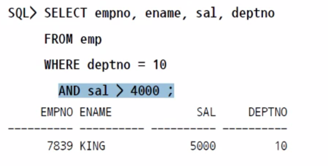
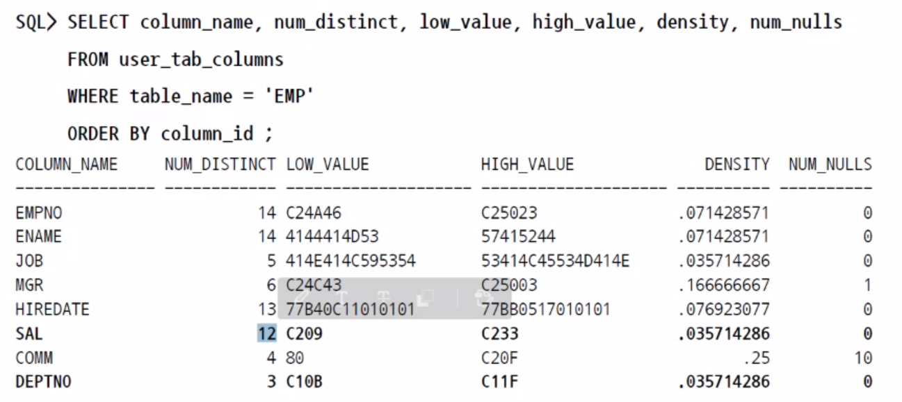
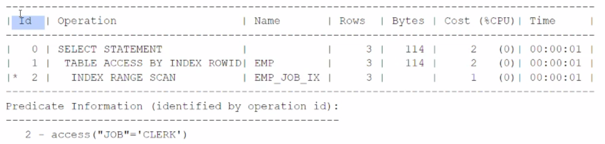
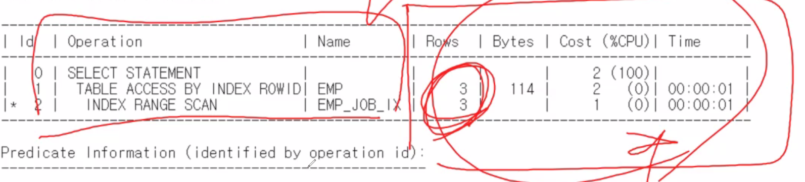

teach01

Oracle_4U2021

# Optimizer

실행계획은 생각과는 다르게 작동할 수도 있다.

위의 질의에서 deptno를 인덱스를 삼는게 타당해 보인다.

하지만 sal > 4000의 데이터 양이 더 적다면 sal을 인덱스화 하는 것이 더 빠르게 찾을 수 있을것이다.

따라서 OPTIMIZER는 직접 데이터의 양을 측정하여 실행계획을 세우는 Function이다.(?)

1. Parse (구문분석) - 실행 계획 확보

   1. 문법 검사

   2. 의미 분석 (객체, 권한 유무 확인)

   3. IF 동일 문장 확인(LIBRARY CACHE)

      TRUE: 실행계획 재사용

      FALSE : 실행계획 생성 및 저장(OPTIMIZER가 이때 실행된다.)

OPTIMIZER는 프로세스가 아니라 하나의 함수이다.

10G 부터는 CBO(Cost Based Optimizer)가 적용되어 사용된다.

CBO가 작동하기 위해서는 테이블의 통계정보를 수집하여야 한다.

CARDINALITY = 총 칼럼의 갯수 / NUM_DISTINCT 예상되는 중복되는 행 갯수

​	(이 숫자가 낮을수록 예상되는 중복값이 적다는 것이고 이를 INDEX로 삼는 것이 유리하다.)

### 실행계획

라이브러리에 저장되어 있는 실행계획 -> 사용된 실행계획

라이브러리에서 사용안 된 실행계획 -> 예상 실행 계획

사용된 실행계획은 현재상황과 과거상황에 따라서 성능이 달라질 수 있다?

예상 된 실행계획은 실제 사용해보지 않았으므로 정확하지 않다.

실제 튜닝을 하려면 실제 사용된 실행 계획을 사용해야 한다.

튜닝을 하려면 `V$SQL`을 조회할 수 있는 DBA권한이 있어야 LIBRARY CACHE를 접근 할 수 있다.

실행계획을 접근했을 때, COST가 나온다면 이는 예상 실행계획이다.

### PLAN TABLE

1. 저장

명령어 `EXPLAIN PLAN FOR`뒤에 질의를 던지면 질의의 결과가 나오지 않고 유저로 부터 받은 질의의 실행계획을 PLAN TABLE에 저장한다.

2. 조회

`SELECT * FROM table(dbms_xplan.display('PLAN_TABLE','demo1','TYPICAL')) ;`

위의 명령어로 PLAN TABLE에 저장된 내용을 꺼내 볼 수 있다.

PLAN TABLE 해석

| ID     | OPERATION            | ROWS          | BYTES            | COST            | TIME      |
| ------ | -------------------- | ------------- | ---------------- | --------------- | --------- |
| 행번호 | 작업을 접근하는 방식 | 예상 ROW의 수 | 예상 BYTE의 크기 | 예상 CPU 할당량 | 예상 시간 |

들여쓰기는 DEPTH를 의미하며 DEPTH가 낮을수록 가장 먼저 사용된다.(가장 먼저 사용되는 건 2번)

*표의 의미는 실제 실행되는 작업??

INDEX RANGE SCAN -> 얻어낸 ROWID를 이용하여 TABLE ACESS를 진행한다.

### 라이브러리 캐쉬

` SELECT * FROM table(dbms_xplan.display_cursor) ; `로 조회

하지만 뒷부분의 ROWS, BYTE들은 예상 계획이다. 따라서 이를 이용하는것은 의미가 없을 수 있다.

> ORANGE `CTRL+E`로 실행계획 접근

