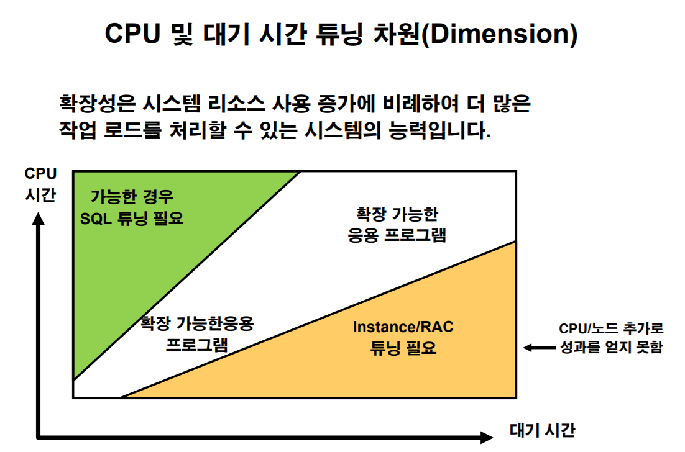
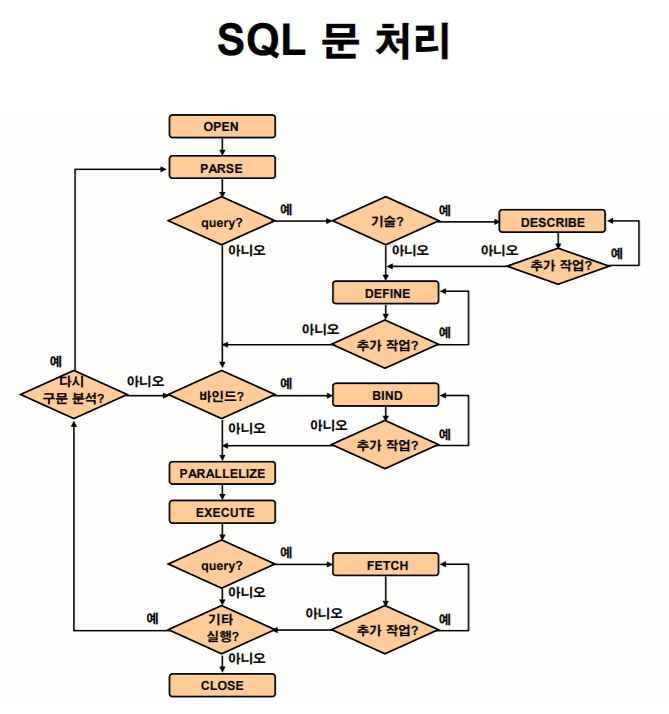
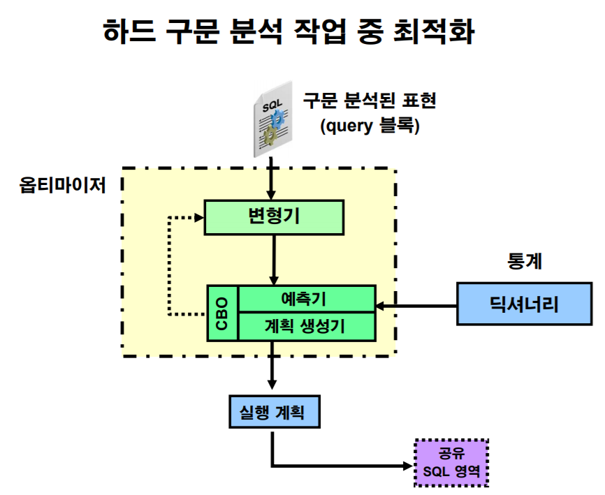
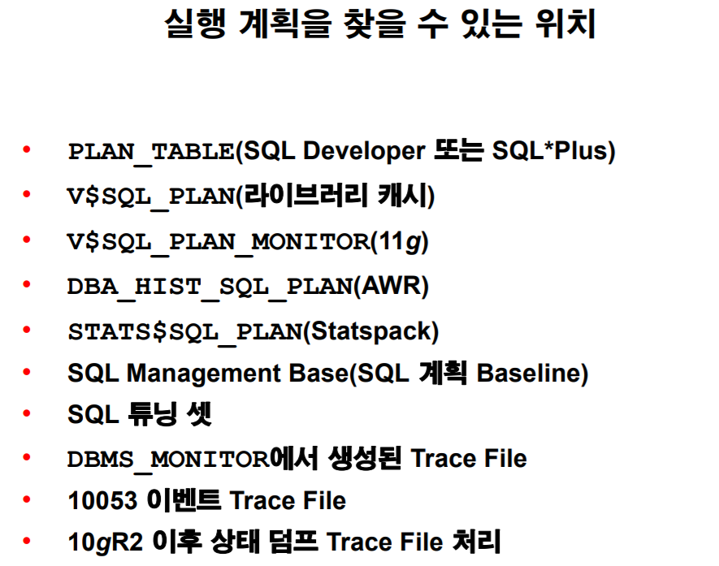
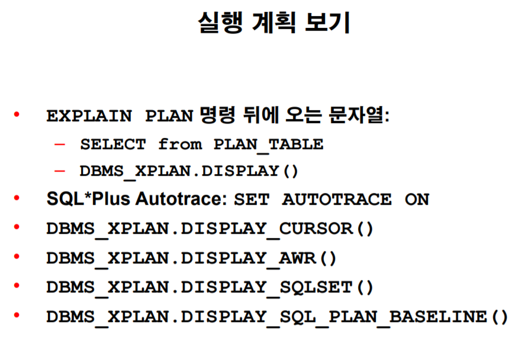
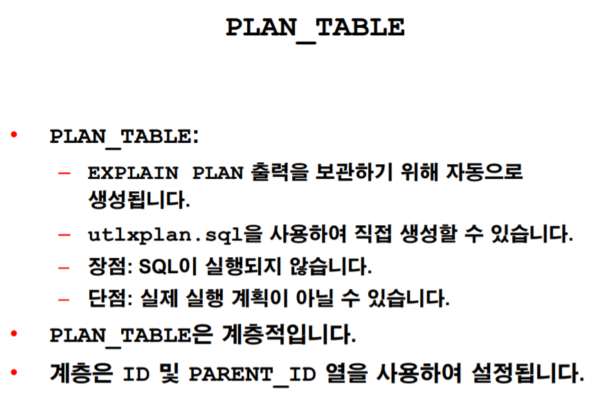
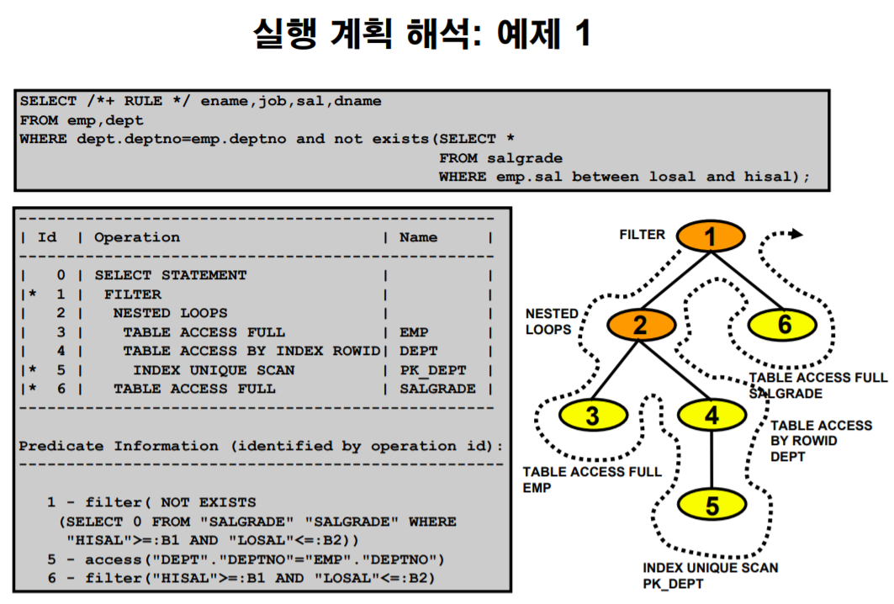
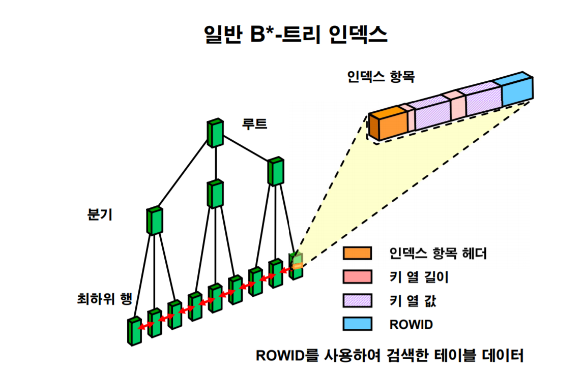

대기시간이 길수록 SQL튜닝보다는 Instance/RAC 튜닝이 필요하다.

대기 시간이 길다는건 병목현상이 일어난다는 것이고 이는 작업을 빠르게 해주는 튜닝보단 병목현상을 제거하는 튜닝이 적합하다.

##### -> 시스템 튜닝이 필요하다!!

## SQL 튜닝 작업

- 로드가 많은 SQL식별

- 통계 수집

- 시스템 통계 생성

- 기존 인덱스 재작성

- 새 인덱스 전략 생성

- 실행 계획 유지 관리

cursor가 데이터 캐쉬에 데이터를 올려 놓는 작업을 FETCH라 한다.

옵티마이저는 CBO가 통계를 보고 인덱스를 쓰는게 유리한지 아닌지를 판단한다.

RBO(Rule Based Optimizer)는 인덱스가 있다면 무조건 인덱스를 썼지만 CBO가 적용된 요즘의 DB는 더 유리한 계획을 세운다.

### 비효율적인 SQL 성능의 원인

- 오래되거나 누락된 옵티마이저 통계
- 누락된 엑세스 구조(잘못된 인덱스 생성)
- 최적 상태가 아닌 실행 계획 선택
  - 만약 옵티마이저 통계가 최신화가 잘 되어 있다면 이런 원인은 잘 안나타나게 된다.
- 잘못 작성된 SQL
  - 반복되는 접근을 줄여라.

# 2. 실행계획 해석

- SQL 문의 실행 계획은 직렬 실행 계획에 대한 행 소스라고 하는 작은 구성 요소로 이루어져 있다.
- 명령문의 행 소스를 결합한 것을 실행 계획이라고 한다.
- 상위- 하위 관계를 사용하여 실행계획을 트리구조로 표현할 수 있다.

> Orange의 경우 서버프로세스를 트레이스 파일로 저장하는 기능을 제공한다.
>
> 도구이용.

##### 실행계획의 종류

1. 실제 실행 계획 (*) 더 중요!
2. 예상 실행 계획

`select * from table(DBMS_XPLAN.DISPLAY(null,null,'ALL'))`

실행계획 순서

위에서부터 만약 뎁스가 있다면 안쪽부터 실행된다.

## Using Index

Table은 데이터 블록으로 이루어져 있다.

이러한 데이터블록은 Acess하기 편하기 위해 연속적인 데이터블록을 묶음, Extent를 사용한다.

Table Full Scan I/O는 Extent를 사용하여 Disk I/O의 횟수를 줄이는 전략을 쓴다.

대량의 데이터를 Acess할 때는 Full Table Scan이 이점이 있다.

하지만 Where절을 이용할때는 느린 방식이다.

ROWID 스캔

하나의 값을 찾을 때, 가장 빠른 접근을 보장하며 물리적순서를 직접 입력하는 것

하지만 모든 순서를 사람이 외워서 접근할 수는 없다.

Index 스캔

인덱스는 정렬상태를 유지하고 있으며 분기점을 지니고 있기 때문에 빠르게 ROWID를 찾을 수 있는 도구이다.

\* 인덱스를 사용하지 못하는 경우 

- 조건식의 부재 

- 칼럼의 변형 

  - 칼럼의 가공이 들어가면 정렬순서가 깨질수도 있기 때문에 인덱스를 사용하지 않는다.

  - 칼럼의 변형이 꼭 필요하다면 함수기반 인덱스를 사용할 수 있다.

    하지만 인덱스가 너무 많다면 디스크 및 이를 유지보수하는데 리소스가 들어가므로 최대한 사용을 자제한다.

- IS NULL, IS NOT NULL 비교 

  - IS NOT NULL은 인덱스를 사용할 수는 있으나  대부분 Null값의 양이 적으므로 풀스캔을 이용하는게 이득인 실행계획이 나온다.

- LIKE 비교 시 %,_ 와일드카드가 앞에 오는 경우 

  - 사전에서 a로 끝나는 문자를 찾는건 힘들다..

- 부정형 비교 

  - 트리구조에서 부정형을 사용한다면 그 구조가아닌 다른 구조를 계속 참조해야한다.

- 암시적인 데이터 타입 변환

  - 칼럼의 변형과 비슷한 경우이다.
  - 항상 칼럼의 데이터타입을 보고 이를 맞춰줘야 한다.
  - 암시적 형변환은 숫자 -> 문자가 우선한다.

