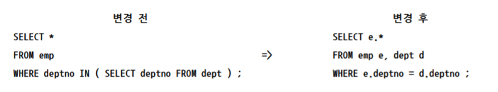
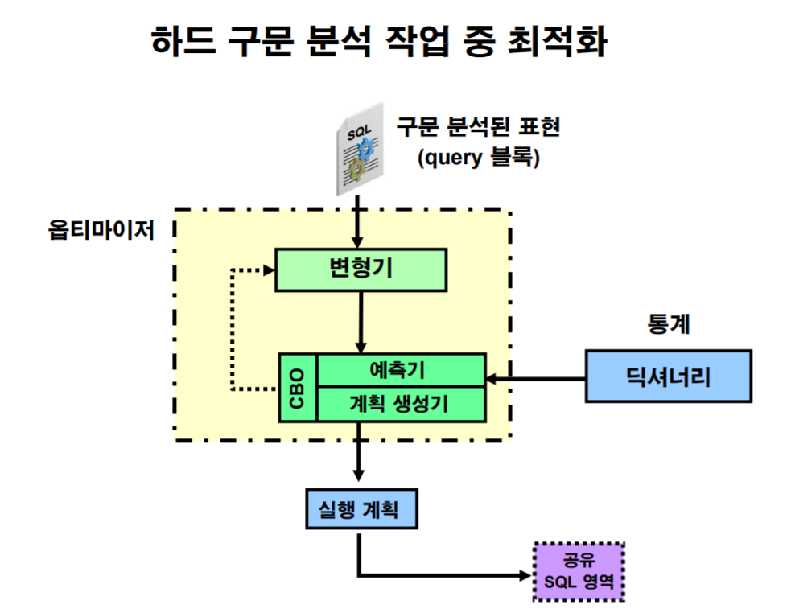

# 옵티마이저 연산자

Join을 써야하는 상황

집합에 대한 접근 자체를 조회해야 할때

서브쿼리만을 사용해야 할 때

집합에 대한 접근을 조회하는 것이 아닌 필터링만을 위해서 사용할 때!


메인쿼리의 컬럼을 참조하지 않는 서브쿼리는 먼저 실행된다.

sub-> main

```mysql
SELECT *
FROM EMP MAIN
WHERE SAL > (SELECT SAL 
               FROM EMP SUB 
              WHERE ENAME = 'JONES' ) ; 
              
              |
              v
              
SELECT *
FROM EMP MAIN
WHERE SAL > (2075) ; 
```


하지만 서브쿼리가 메인쿼리의 칼럼을 참조한다면 메인쿼리가 먼저 실행 될 수 있다.

main -> sub

```mysql
SELECT * 
FROM DEPT D 
WHERE EXISTS (SELECT 1 
                FROM EMP 
                WHERE DEPTNO = D.DEPTNO) ; 

```


이처럼 접근 방법의 순서는 하나뿐이다??

순서를 바꾼다면 효율이 증가할 수 있다.


이는 서브쿼리를 사용했지만 마치 Join처럼 접근 순서를 바꾸는 경우이다.

```mysql
SELECT * 
FROM EMP 
WHERE DEPTNO IN (SELECT DEPTNO FROM DEPT) ;

@xplan 
-----------------------------------------------------------------------------------------------
| Id  | Operation          | Name           | Starts | E-Rows | A-Rows |   A-Time   | Buffers |
-----------------------------------------------------------------------------------------------
|   0 | SELECT STATEMENT   |                |      1 |        |     14 |00:00:00.01 |       8 |
|   1 |  NESTED LOOPS      |                |      1 |     14 |     14 |00:00:00.01 |       8 |
|   2 |   TABLE ACCESS FULL| EMP            |      1 |     14 |     14 |00:00:00.01 |       4 |
|*  3 |   INDEX UNIQUE SCAN| DEPT_DEPTNO_IX |     14 |      1 |     14 |00:00:00.01 |       4 |
-----------------------------------------------------------------------------------------------
Predicate Information (identified by operation id):
---------------------------------------------------
   3 - access("DEPTNO"="DEPTNO")

```

옵티마이저는 서브쿼리를 포함한 문장은 쿼리트랜스포메이션을 통해 join처럼 변경한다.





여기서 변형기가 위의 작업을 수행하는 놈이다.

서브쿼리보단 join의 경우의 수가 많으므로 더 빠른 방식의 접근이 가능하다.(하지만 실질적으로 이런경우가 많지는 않다.)

```mysql
SELECT * 
FROM EMP 
WHERE SAL > (SELECT SAL 
               FROM EMP 
              WHERE ENAME = 'JONES') ;
              
@xplan
--------------------------------------------------------------------------------------------------------
| Id  | Operation                     | Name         | Starts | E-Rows | A-Rows |   A-Time   | Buffers |
--------------------------------------------------------------------------------------------------------
|   0 | SELECT STATEMENT              |              |      1 |        |      3 |00:00:00.01 |       6 |
|   1 |  TABLE ACCESS BY INDEX ROWID  | EMP          |      1 |      1 |      3 |00:00:00.01 |       6 |
|*  2 |   INDEX RANGE SCAN            | EMP_SAL_IX   |      1 |      1 |      3 |00:00:00.01 |       4 |
|   3 |    TABLE ACCESS BY INDEX ROWID| EMP          |      1 |      1 |      1 |00:00:00.01 |       2 |
|*  4 |     INDEX RANGE SCAN          | EMP_ENAME_IX |      1 |      1 |      1 |00:00:00.01 |       1 |
--------------------------------------------------------------------------------------------------------
Predicate Information (identified by operation id):
---------------------------------------------------
   2 - access("SAL">)
   4 - access("ENAME"='JONES')
```

위처럼의 기본적인 서브쿼리 하나의 컬럼을 반환하는 경우는 서브쿼리 방식으로 실행된다. ( **> 연산자**를 통해 하나의 값만이 나올것을 유추가능하다.)


하지만  **IN 연산자** 처럼 서브쿼리가 다양한 결과값이 나오는 경우 오라클은 쿼리트랜스포머를 작동시킨다.

연산자가 매우 쿼리 트랜스포머를 작동시킬때 굉장히 중요하다.


`/*+ no_query_transformation */`, `/*+ no_unnest */` 힌트를 이용해 쿼리트랜스포머를 사용 안 할 수 있다.

```mysql

SELECT /*+ no_query_transformation */ * 
FROM EMP 
WHERE DEPTNO IN (SELECT DEPTNO FROM DEPT) ; 
@xplan 
2-3-1-0
-----------------------------------------------------------------------------------------------
| Id  | Operation          | Name           | Starts | E-Rows | A-Rows |   A-Time   | Buffers |
-----------------------------------------------------------------------------------------------
|   0 | SELECT STATEMENT   |                |      1 |        |     14 |00:00:00.01 |       7 |
|*  1 |  FILTER            |                |      1 |        |     14 |00:00:00.01 |       7 |
|   2 |   TABLE ACCESS FULL| EMP            |      1 |     14 |     14 |00:00:00.01 |       4 |
|*  3 |   INDEX UNIQUE SCAN| DEPT_DEPTNO_IX |      3 |      1 |      3 |00:00:00.01 |       3 |
-----------------------------------------------------------------------------------------------
Predicate Information (identified by operation id):
---------------------------------------------------
   1 - filter( IS NOT NULL)
   3 - access("DEPTNO"=:B1)

```

위와 같은 경우도 어쨌든 먼저 드라이빙 되는건 메인쿼리다!

따라서 `/*+ no_query_transformation */`힌트는 사용할 이유가 없다.


그럼 굳이 서브쿼리를 사용해야만 하나??

```mysql
SELECT *
FROM DEPT 
WHERE DEPTNO IN (SELECT DEPTNO FROM EMP) ;
@xplan
----------------------------------------------------------------------------------------------
| Id  | Operation          | Name          | Starts | E-Rows | A-Rows |   A-Time   | Buffers |
----------------------------------------------------------------------------------------------
|   0 | SELECT STATEMENT   |               |      1 |        |      3 |00:00:00.01 |       6 |
|   1 |  NESTED LOOPS SEMI |               |      1 |      3 |      3 |00:00:00.01 |       6 |
|   2 |   TABLE ACCESS FULL| DEPT          |      1 |      4 |      4 |00:00:00.01 |       4 |
|*  3 |   INDEX RANGE SCAN | EMP_DEPTNO_IX |      4 |      9 |      3 |00:00:00.01 |       2 |
----------------------------------------------------------------------------------------------
Predicate Information (identified by operation id):
---------------------------------------------------
   3 - access("DEPTNO"="DEPTNO")

-- 잘 보면 위의 식은 JOIN을 사용하는 것이 아닌 JOIN 의 형식만을 빌린 SEMI형식이다.
-- SEMI JOIN은 두 테이블을 병합하는 과정은 진행하지 않는다.

SELECT d.* 
FROM EMP E, DEPT D 
WHERE E.DEPTNO = D.DEPTNO ;

    DEPTNO DNAME          LOC
---------- -------------- -------------
        10 ACCOUNTING     NEW YORK
        10 ACCOUNTING     NEW YORK
        10 ACCOUNTING     NEW YORK
        20 RESEARCH       DALLAS
        20 RESEARCH       DALLAS
        20 RESEARCH       DALLAS
        20 RESEARCH       DALLAS
        20 RESEARCH       DALLAS
        30 SALES          CHICAGO
        30 SALES          CHICAGO
        30 SALES          CHICAGO
        30 SALES          CHICAGO
        30 SALES          CHICAGO
        30 SALES          CHICAGO

14 rows selected.

-- 이처럼 JOIN의 형식을 사용한다고 해서 직접 조인을 사용한다면 병합하는 과정때문에 원하는 값이 여러개 나올 수 있다.

```

밑의 경우처럼 실제 조인으로 사용을 한다면 값이 중복되어 나오기 때문에 효율적인 계산이 힘들다.

따라서 실제 화면에 보여주려고 하는 것이 두 테이블 모두일 경우에만 JOIN을 쓰자.

단순 필터링의 역할로만 쓴다면 배운대로 서브쿼리를 쓰자!

알아서  JOIN의 성능을 빌려쓰는 S`MI JOIN을 사용할 것이다.


### 결론 

- 둘 이상의 행을 출력하는 Subquery는 Query Transformation을 통해 Join Operation으로 변경될 수 있다. 
- WHERE 절의 Subquery 문장이 Join의 처리 방식으로 변경되는 것을 "Semi Join"이라 한다. 
- Semi Join 은 다양한 조인 방법 및 조인 순서를 사용하여 문장의 최적화에 도움을 줄 수 있다. 
- Subuqery 문장을 Semi Join 방식으로 변경할 경우 "UNNEST" 힌트 사용 
- Subuqery 문장을 FILTER 방식으로 처리할 경우 "NO_UNNEST" 힌트 사용


## Anti Join

```mysql
SELECT * 
FROM DEPT D 
WHERE DEPTNO IN (SELECT DEPTNO FROM EMP) ; 

SELECT * 
FROM DEPT D 
WHERE DEPTNO IN (10,20,30,NULL) ; 

-- 위 문장은 같은 결과를 낸다.

SELECT * 
FROM DEPT D 
WHERE DEPTNO = 10
   OR DEPTNO = 20
   OR DEPTNO = 30
   OR DEPTNO = NULL ;    => IS NULL, IS NOT NULL

-- 위 식처럼 NULL은 긍정도 부정도 아니기 때문에 NULL을 제외한 모든 값이 나온다.
-- 위 식과 같이 처리가 되기 때문에 밑에 식은 안 나오게 된다.

SELECT * 
FROM DEPT D 
WHERE DEPTNO NOT IN (SELECT DEPTNO FROM EMP) ; 

no rows selected

-- NOT IN을 쓰게 되면 모든 행을 부정하고 NULL 조건은 긍정도 부정도 아니므로 모든 행이 나오지 않는다.


SELECT * 
FROM DEPT D 
WHERE DEPTNO != 10
  AND DEPTNO != 20
  AND DEPTNO != 30
  AND DEPTNO != NULL ;    => IS NULL, IS NOT NULL
  
-- 위 식을 풀어쓰고 부정하면 이렇게 된다.
-- 따라서 NOT IN은 NULL이 있을 시 모든 행을 만족 할 수 없으므로 사용하지 않는 것이 좋다.
-- Oracle은 내부적으로 NOT IN에 NULL이 있을 경우 어차피 시행이 안될것이므로 계산을 하지 않는다.


SELECT * 
FROM DEPT D 
WHERE DEPTNO NOT EXISTS (SELECT DEPTNO FROM EMP) ; 

```

Anti Join을 제대로 사용하려면 Not EXISTS 연산이 필요하다.

FILTER보다 빠르게 작동하는 조인이다.

```mysql
SELECT *
FROM dept d
WHERE NOT EXISTS ( SELECT *
                    FROM emp
                   WHERE deptno = 10 ) ;
@xplan
2-3-1-0
----------------------------------------------------------------------------------------------
| Id  | Operation          | Name          | Starts | E-Rows | A-Rows |   A-Time   | Buffers |
----------------------------------------------------------------------------------------------
|   0 | SELECT STATEMENT   |               |      1 |        |      1 |00:00:00.01 |       5 |
|   1 |  NESTED LOOPS ANTI |               |      1 |      1 |      1 |00:00:00.01 |       5 |
|   2 |   TABLE ACCESS FULL| DEPT          |      1 |      4 |      4 |00:00:00.01 |       3 |
|*  3 |   INDEX RANGE SCAN | EMP_DEPTNO_IX |      4 |      9 |      3 |00:00:00.01 |       2 |
----------------------------------------------------------------------------------------------
Predicate Information (identified by operation id):
---------------------------------------------------
   3 - access("DEPTNO"="D"."DEPTNO")

```

ANTI JOIN은 SP에 옮기는 과정을 단지 JOIN칼럼 조건이 부정형일 때 옮기는 반대 JOIN이다.


- Subquery를 사용할 때 QB_NAME 힌트를 이용하여 각각의 Query Block의 식별 및 제어 가능

```mysql
SQL> SELECT /*+ qb_name(main) */ *
 FROM emp
 WHERE sal > ( SELECT /*+ qb_name(sub) */ sal
 FROM emp
 WHERE empno = 7566 ) ;
 
SQL> SELECT *
 FROM table(dbms_xplan.display_cursor(null,null,'IOSTATS LAST +alias')) ;
--------------------------------------------------------------------------------------------------------
| Id | Operation | Name | Starts | E-Rows | A-Rows | A-Time | Buffers |
--------------------------------------------------------------------------------------------------------
| 0 | SELECT STATEMENT | | 1 | | 3 |00:00:00.01 | 6 |
| 1 | TABLE ACCESS BY INDEX ROWID | EMP | 1 | 3 | 3 |00:00:00.01 | 6 |
|* 2 | INDEX RANGE SCAN | EMP_SAL_IX | 1 | 3 | 3 |00:00:00.01 | 4 |
| 3 | TABLE ACCESS BY INDEX ROWID| EMP | 1 | 1 | 1 |00:00:00.01 | 2 |
|* 4 | INDEX UNIQUE SCAN | EMP_EMPNO_IX | 1 | 1 | 1 |00:00:00.01 | 1 |
--------------------------------------------------------------------------------------------------------
Query Block Name / Object Alias (identified by operation id):
-------------------------------------------------------------
 1 - MAIN / EMP@MAIN
 2 - MAIN / EMP@MAIN
 3 - SUB / EMP@SUB
 4 - SUB / EMP@SUB
Predicate Information (identified by operation id):
---------------------------------------------------
 2 - access("SAL">)
 4 - access("EMPNO"=7566)

```


또한 서브쿼리의 순서도 지정해 줄 수 있다.

```mysql
SELECT /*+ qb_name(main) unnest(@sub) leading(e@sub) use_nl(d@main) */ *
	FROM dept d
	WHERE EXISTS ( SELECT /*+ qb_name(sub) */ *
					 FROM emp e
 					WHERE deptno = d.deptno ) ;
```


`/*+ hash_sj */` 힌트를 이용해 해쉬 세미조인을 사용하게 할 수 있다.


`/*+ swap_join_inputs() */`

Database 10g 버전부터는 `swap_join_inputs` 힌트를 사용하여 Outer Join 에서 데이터가 없는 쪽을 Driving Table 로 사용 가능하게 한다. 단, Hash Join 에서 사용 가능하다.

NOT EXISTS 나 NOT IN 연산은 Subquery 결과에 없는 Main Query 값을 검색하는 문장이다. 즉, 조인 문으로 변경되면 Outer Join의 결과이다. 때문에 값이 존재하지 않는 Subquery를 먼저 Driving 할 수 없다. 때문에 SWAP_JOIN_INPUTS 힌트를 이용하여 Hash Join 으로만 조인 순서를 변경할 수 있다.


`/*+ nl_aj */` 힌트를 이용해서 Native Anti Join을 사용하게 할수도 있다.


```mysql
SELECT PROD_ID, SUM(AMOUNT_SOLD) 
FROM SALES 
GROUP BY PROD_ID  ; 
@xplan 
--------------------------------------------------------------------------------------------------------------------------
| Id  | Operation          | Name  | Starts | E-Rows | A-Rows |   A-Time   | Buffers | Reads  |  OMem |  1Mem | Used-Mem |
--------------------------------------------------------------------------------------------------------------------------
|   0 | SELECT STATEMENT   |       |      1 |        |     72 |00:00:02.32 |    4435 |   4431 |       |       |          |
|   1 |  HASH GROUP BY     |       |      1 |     72 |     72 |00:00:02.32 |    4435 |   4431 |   798K|   798K| 2552K (0)|
|   2 |   TABLE ACCESS FULL| SALES |      1 |    918K|    918K|00:00:01.15 |    4435 |   4431 |       |       |          |
--------------------------------------------------------------------------------------------------------------------------

-- 정렬 안되는 해쉬 그루핑

SELECT PROD_ID, SUM(AMOUNT_SOLD) 
FROM SALES 
GROUP BY PROD_ID  
ORDER BY PROD_ID ; 
@xplan 
--------------------------------------------------------------------------------------------------------------------------
| Id  | Operation          | Name  | Starts | E-Rows | A-Rows |   A-Time   | Buffers | Reads  |  OMem |  1Mem | Used-Mem |
--------------------------------------------------------------------------------------------------------------------------
|   0 | SELECT STATEMENT   |       |      1 |        |     72 |00:00:02.42 |    4435 |   4431 |       |       |   |
|   1 |  SORT GROUP BY     |       |      1 |     72 |     72 |00:00:02.42 |    4435 |   4431 |  4096 |  4096 | 4096  (0)|
|   2 |   TABLE ACCESS FULL| SALES |      1 |    918K|    918K|00:00:01.15 |    4435 |   4431 |       |       |   |
--------------------------------------------------------------------------------------------------------------------------


-- 정렬된 소트 그루핑


SELECT *
FROM (SELECT PROD_ID, SUM(AMOUNT_SOLD)
        FROM SALES 
       GROUP BY PROD_ID) 
ORDER BY PROD_ID ; 
@xplan
--------------------------------------------------------------------------------------------------------------------------
| Id  | Operation          | Name  | Starts | E-Rows | A-Rows |   A-Time   | Buffers | Reads  |  OMem |  1Mem | Used-Mem |
--------------------------------------------------------------------------------------------------------------------------
|   0 | SELECT STATEMENT   |       |      1 |        |     72 |00:00:02.41 |    4435 |   4431 |       |       |   |
|   1 |  SORT GROUP BY     |       |      1 |     72 |     72 |00:00:02.41 |    4435 |   4431 |  4096 |  4096 | 4096  (0)|
|   2 |   TABLE ACCESS FULL| SALES |      1 |    918K|    918K|00:00:01.14 |    4435 |   4431 |       |       |   |
--------------------------------------------------------------------------------------------------------------------------

-- 이렇게 하더라도 해쉬그루핑을 사용하지는 않는다. 왜냐하면 뷰머징이라는 과정을 통해 FROM절의 테이블이 위의 테이블처럼 쿼리를 바꿔주기 때문이다.


SELECT *
FROM (SELECT /*+ no_merge */ PROD_ID, SUM(AMOUNT_SOLD)
        FROM SALES 
       GROUP BY PROD_ID) 
ORDER BY PROD_ID ; 
@xplan
4-3-2-1-0
----------------------------------------------------------------------------------------------------------------------------
| Id  | Operation            | Name  | Starts | E-Rows | A-Rows |   A-Time   | Buffers | Reads  |  OMem |  1Mem | Used-Mem |
----------------------------------------------------------------------------------------------------------------------------
|   0 | SELECT STATEMENT     |       |      1 |        |     72 |00:00:02.34 |    4435 |   4431 |       |       |   |
|   1 |  SORT ORDER BY       |       |      1 |     72 |     72 |00:00:02.34 |    4435 |   4431 |  6144 |  6144 | 6144    (0)|
|   2 |   VIEW               |       |      1 |     72 |     72 |00:00:02.34 |    4435 |   4431 |       |       |   |
|   3 |    HASH GROUP BY     |       |      1 |     72 |     72 |00:00:02.34 |    4435 |   4431 |   798K|   798K| 2536K (0)|
|   4 |     TABLE ACCESS FULL| SALES |      1 |    918K|    918K|00:00:01.15 |    4435 |   4431 |       |       |   |
----------------------------------------------------------------------------------------------------------------------------

-- /*+ no_merge */ 힌트를 통해 뷰머징을 막을 수 있다.
-- 여기서는 해쉬 그루핑을 통해 더 빠르게 작업을하고 비록 소트작업을 따로 하더라도 그루핑된 72개의 항목만 소팅하면 되므로 더 빠른 속도를 보장한다.


```

 

뷰머징을 통해 힌트가 안먹을 때도 있으므로 No_merge옵션을 사용해야 힌트를 사용할 수 있는 경우도 있다.

> case study - 8번