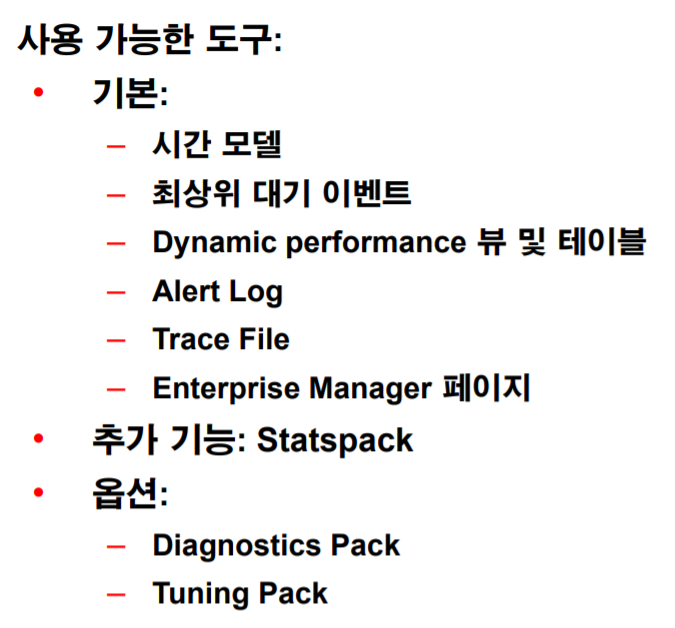
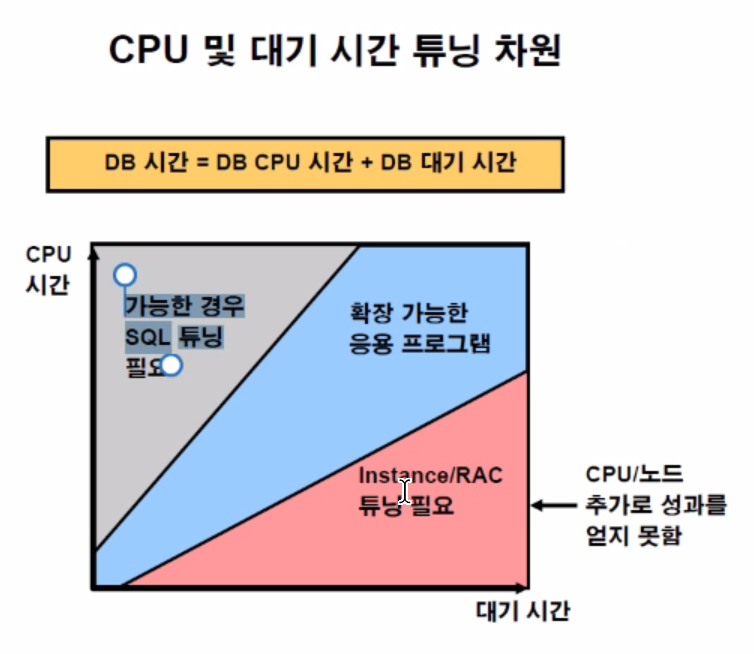
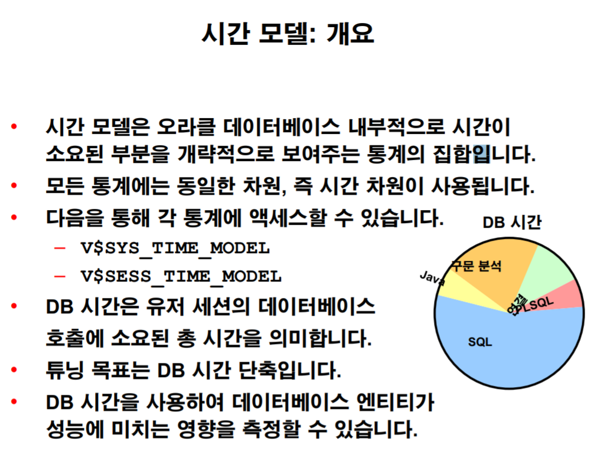
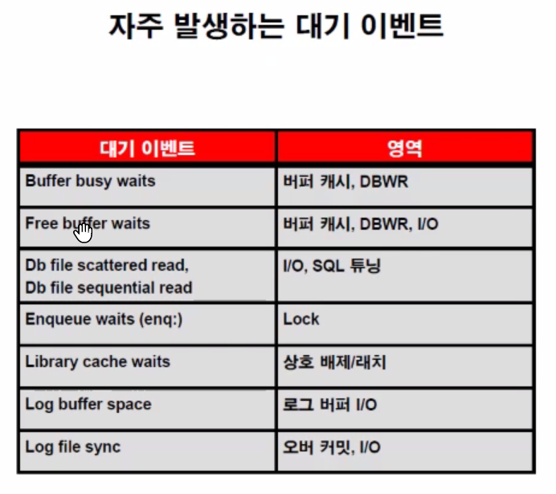
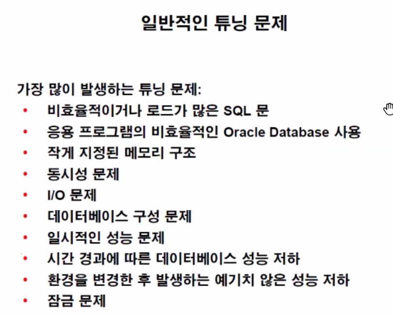
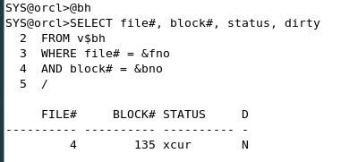
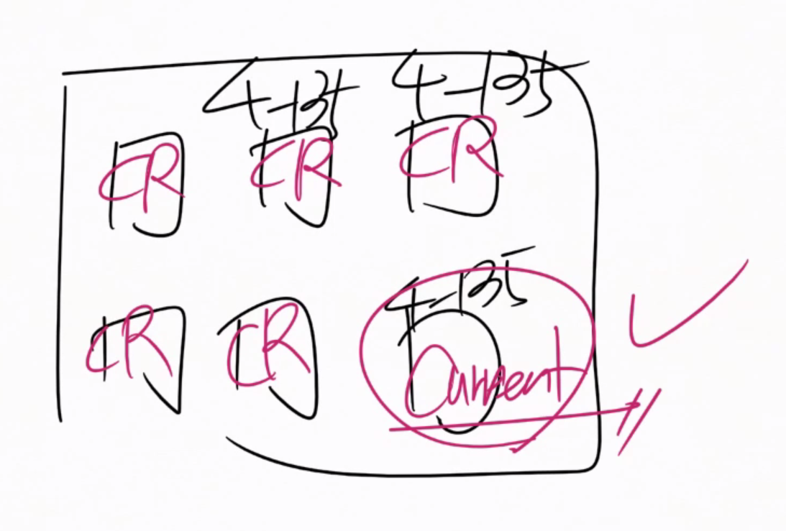

# 시스템 성능 진단

### 성능 튜닝 진단

- 누적통계
  - 시간 정보가 포함된 대기 이벤트
  - 시간이 얼마나 걸렸는지에 대한 정보
  - 누적통계는 여태까지의 누적 값이기 때문에 구간별로 확인하지 않는다면 성능을 제대로 확인 할 수 없다.
  - s


`v$sysstat` : shared pool에 DB가 얼마만큼의 일을 진행했는지 모든 데이터를 저장.

수동으로 Metrics(누적정보의 변화율) 작업하기

```mysql
-- 작업 전 v$sysstat
SQL> CREATE TABLE STAT1 AS SELECT * FROM v$sysstat ;

-- 작업시작
SQL> SELECT COUNT(*) FROM sh.sales s, sh.customers c
WHERE s.cust_id = c.cust_id ;

-- 작업 후 v$sysstat
SQL> CREATE TABLE STAT2 AS SELECT * FROM v$sysstat ;


SQL> SELECT *
        FROM (SELECT a.statistic#, a.name, a.class, b.value - a.value AS DIFF /*A와 B의 차이*/
                FROM stat1 a, stat2 b
               WHERE a.statistic# = b.statistic#
               ORDER BY diff DESC)
	   WHERE rownum <= 5 ;
	   
STATISTIC# NAME CLASS DIFF
---------- -------------------------------------------------- ---------- ----------
 51 cell physical IO interconnect bytes 64 5820928
 47 physical read total bytes 8 5488640
 77 physical read bytes 8 5373952
 50 physical write total bytes 8 175104
 26 session uga memory max 1 65512
 
SQL> DROP TABLE STAT1 PURGE ;
SQL> DROP TABLE STAT2 PURGE ;
```


이렇게 DBA가 일일히 분석할 수는 없으므로 Metrics가 중요하다.


### 성능 튜닝 도구



옵션은 추가로 구매해야 사용이 가능하다.

`V$`로 시작하는 애들은 다이나믹 퍼포먼스 뷰이다.


### 튜닝의 목표

- 응답 시간 최소화
  - 응답시간 = DB 대기 시간 + DB CPU 시간
- 처리량 증가
- 로드 용량 증가
- Recovery 시간 단축





가장 많이 사용되는 시간을 줄이는 튜닝을 하는 것이 효율적이다.

`V$SYS_TIME_MODEL` : 시스템이 얼마나 사용하는 누적 시간 테이블

`V$SESS_TIME_MODEL` : 현재 세션이 시간을 얼마나 사용하는지의 누적 시간 테이블


### Wait event

- 대기 이벤트 모음은 다양한 원인으로 대기했어야 하거나 대기해야 할 세션에 대한 정보를 제공함
- `V$EVENT_NAME`으로 어떤 이벤트가 있는지 조회가 가능함.
- `V$SYSTEM_EVENT` 등으로 실제 db가 만난 이벤트들을 조회할 수 있다.

- 

buffer busy waits는 pinning과 관련된 wait이다.


# 문제 정의

##### 문제 발생 위치

- 인스턴스, 운영체제, sql등 어디든 발생할 수 있다.


##### 우선 순위 설정

- 수행된 작업과 작업 대기시간을 비교하여 시스템 성능을 분석합니다.
- 가장 많은 시간이 걸린 구성 요소를 파악합니다.
  - 하나의 문장이 얼마나 수행시간을 지니느냐를 말하는 것이 아닙니다.
  - 총 토탈 DB타임이 중요하다. 단 10초짜리 문장이라도 하루에 수백명이 접근하는 문장이라면 토탈 DB타임은 커질 수 있습니다.
- 이러한 구성 요소를 중점적으로 튜닝합니다.


##### 도구들

- Top 5 Timed Events

- Top SQL 보고서

##### 


##### 프로그램의 수명 주기

- 설계 및 개발
- 테스트
- 배치: 새 기능 추가
- 운용 : 문제 해결 및 튜닝
- 이전, 업그레이드 및 환경 변경(차세대 등)


수명주기 동안의 튜닝

- 사전 튜닝
  - 테스트 시나리오를 통해 문제가 일어나지 않도록 예방하는 튜닝
- 사후 튜닝
  - 활성 Instance 모니터링 중 문제 발생시 시행되는 튜닝 


### 실습

```mysql


SQL> SELECT * FROM v$sysstat ;

-- WAIT EVENT 조회
SQL> SELECT * FROM v$system_event ;

-- SGA의 상태
SQL> SELECT * FROM v$sgastat ;
SQL> SELECT * FROM v$pgastat ;
SQL> SELECT * FROM v$sesstat ;
SQL> SELECT * FROM v$mystat ;


SQL> SELECT * FROM v$session_event ;
SQL> SELECT * FROM v$session_wait ;
SQL> SELECT * FROM v$sys_time_model ORDER BY value DESC ;
SQL> SELECT * FROM v$sess_time_model ORDER BY SID, value DESC ;
SQL> SELECT * FROM v$system_wait_class ;
SQL> SELECT * FROM v$service_wait_class ;
SQL> SELECT * FROM v$session_wait_class ;
SQL> SELECT * FROM v$service_stats ;
SQL> SELECT * FROM v$service_event ;
SQL> SELECT * FROM v$metricname ;
SQL> SELECT * FROM v$sysmetric ;
SQL> SELECT * FROM v$sessmetric ;
SQL> SELECT * FROM v$servicemetric ;
SQL> SELECT * FROM v$filemetric ;
SQL> SELECT * FROM v$eventmetric ;
SQL> SELECT * FROM v$waitclassmetric ;
SQL> SELECT * FROM v$event_histogram ;
SQL> SELECT * FROM v$file_histogram ; 
```


SNAP SHOT 건강했던 시점의 구간을 base_line으로 삼아 이시점의 변화율을 넘어서는 부하를 받는다면 dba에게 연락을 줄 수 있는 작업을 진행하게 할 수 있다.

하지만 변화하는 DB의 상황을 고려한다면 너무 오래전의 BASE_LINE을 사용하는 것은 바람직하지 못하다.

따라서 이를 일주일을 기준으로 새로운 BASE_LINE을 삼을 수 있도록 자동으로 일주일 치의 BASE_LINE을 생성한다.


스냅샷의 생성주기 및 보관 기간도 설정 할 수 있다.


## buffer cash 튜닝

데이터 버퍼 캐쉬는 진짜 데이터 블록을 데이터 버퍼 메모리에 올려서 작업하는 걸까??

 `v$bh`는 버퍼캐시 헤더를 조회하는 문장이다.



STATUS: XCUR(exclusive current)상태  최신상태를 의미한다.(DML이 가능한 메모리 버퍼)


status: cr(consistent Read)블록이 생성된다.

##### Consistent Read블럭

- 읽기 전용으로 생긴 DML이 불가능한 블럭

하나의 DataBlockAddress를 갖는 버퍼들이 여러개 생길수도 있다.

같은 DBA의 current 상태의 데이터 버퍼는 항상 하나일 수 밖에 없다.

undo data가 존재한다면 데이터 버퍼를 복사해 언두데이터를 덮어씌워 보여준다.

읽기 일관성을 유지하기 위해 생성하고 이를 덮어 씌운 이미지를 Consistent Read Buffer라고 한다.

