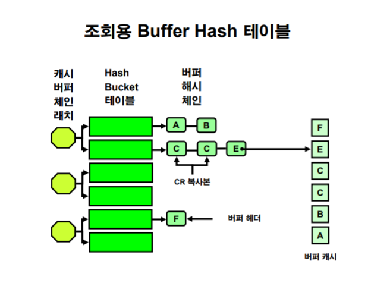
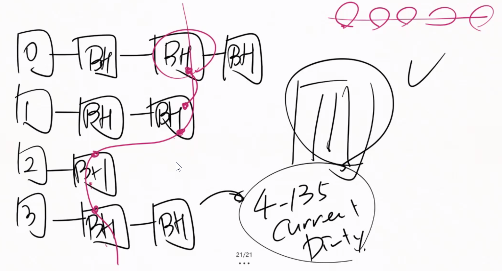
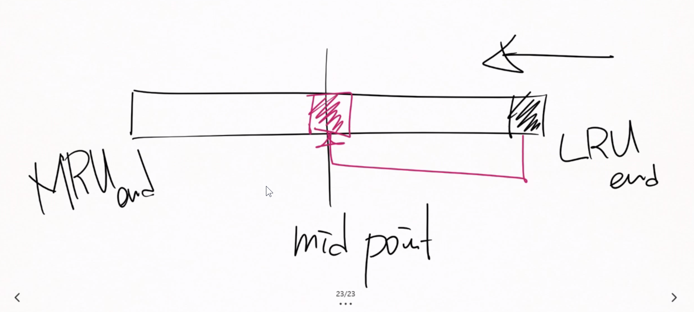
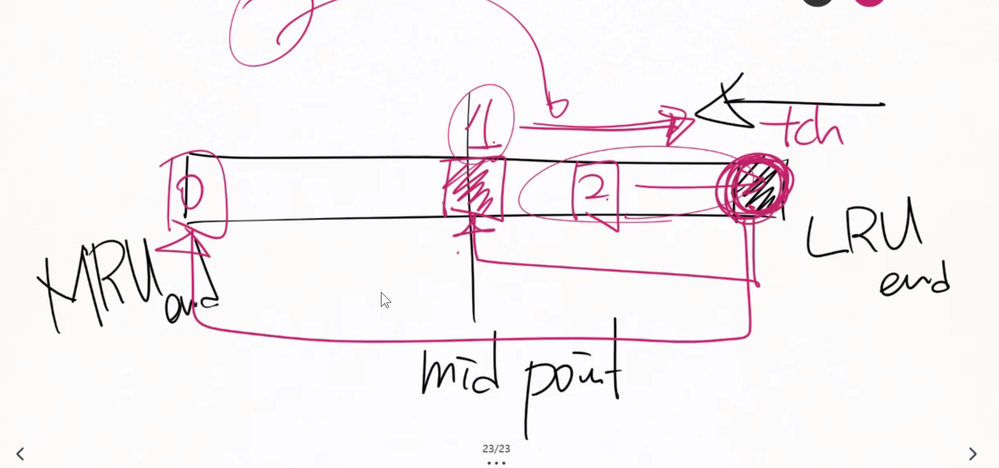
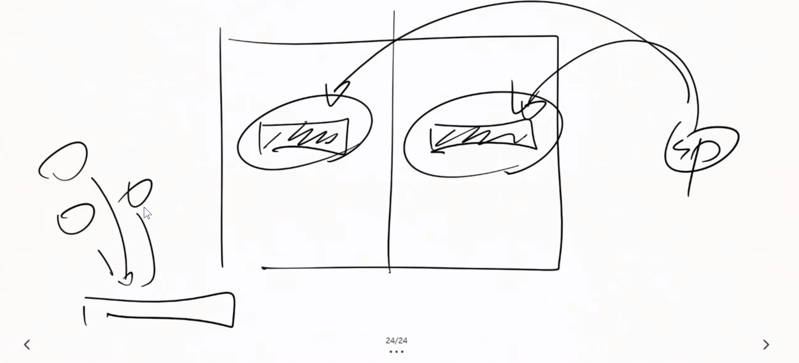
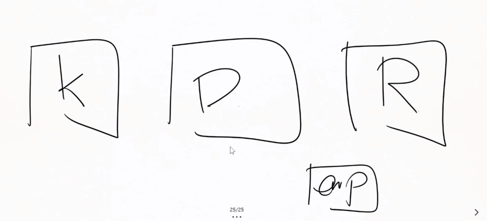

# 


commit과 상관없이 current버퍼는 데이터파일에 저장될 수 있다.(commit 없이도 데이터 파일에 DBRW가 저장할 수 있다.)

COMMIT은 리두로그 버퍼를 내려쓰라는 얘기일 뿐이다.

` ALTER SYSTEM FLUSH BUFFER_CACHE ;`명령어를 통해 데이터 버퍼 캐쉬를 비울 수 있다.

이때 STATUS는 FREE상태가 된다.


LOCK은 데이터블록의 헤더에서 ROW HEADER로 찾아가야 LOCK BYTE를 찾을 수 있다.


Delayed Block Cleanout : 락이 걸린 상태로 내려갔을 때, 커밋 후 메모리 버퍼캐쉬가 지워졌다. 이 때, 접근시 락이 걸린 상태의 데이터블록이 올라오게 되고 이를 나중에 풀어주게 된다. 이때 데이터 블록과 데이터 버퍼의 상태가 달라지므로 더티 버퍼가 된다.  


데이터 블록의 구조

Header : DBA가 저장되어 있음. Clean인지 아닌지도


데이터 버퍼는 데이터블록처럼 헤더에 주소값을 지니지 않는다. 데이터를 올려서 조회한다면 비어있는 공간 아무 곳에 읽어올 수 있다.(LRU Algorithm을 통해 빈공간 관리) 데이터블록과 같은 크기를 같는다.


만약 조회를 내리면 실제 데이터 버퍼캐쉬를 모두 조회해야 할까??

Buffer header가 따로 존재한다. buffer와 1대1로 서로에게 영향을 끼친다.

Buffer header는 몇바이트 정도로 매우 적다. 블록의 어드레스, status, 자신이 관리하는 버퍼 에대 한 정보를 지니고 있다.(버퍼를 유지관리하기 위한 메타정보)


그럼 버퍼헤더는 어떻게 데이터버퍼를 관리할까? -> 해쉬함수

해쉬함수의 리턴값이 같은 애들을 모아 놓는 공간을 해쉬 버켓이라고 한다.



버킷들은 같은 해쉬함수의 리턴값을 지닌 버퍼헤더들의 모음이다.

내가 찾아야하는 DBA를 해쉬함수에 넣으면 리턴값이 나오고 이는 어떤 해쉬 버켓 테이블을 찾아야 하는지 알 수 있다.

해쉬 버켓 테이블은 링크드리스트 형태로 버퍼 헤더를 저장하고 있다.(버퍼해시체인)

DBA를 기준으로 해쉬 버킷 테이블이 나뉘므로 CR, Xcur등의 상태가 다른 버퍼헤더들도 같은 해시 버킷 테이블에 저장될 수 밖에 없다.

또한, 버퍼해시체인에서 찾을 수 없다면 이는 데이터블록을 직접 데이터 버퍼에 올려야 함을 의미한다.

만약 SP가 버퍼를 탐색한다면 pin을 건다.


#### pinning과 locking의 차이

pinning은 데이터 버퍼가 작업중에 사라지거나 바뀌는 걸 막는 것이다. 

locking은 읽기일관성을 위해 누군가 DML이 동시에 한 ROW로 접근하는 것을 막는 것이므로 다르다.

pinning은 데이터 버퍼 헤더에서 다른 SP가 참조하는 걸 막는다.


hash함수는 항상 일정한 것이 아니라 구조가 바뀔수도 있다. 이를 막기위한 장치는?

#### 캐시버퍼체인래치

래치는 아주 가벼운 잠금장치(문고리)이다.

해쉬함수의 리턴값을 바탕으로 내부적으로 어떤 래치가 보호하는 버킷인지를 알 수 있다.

그렇다면 래치를 획득하러 간다.

래치를 획득한다면 pin을 획득하고 데이터버퍼를 참조하러 갈 때 까지 같은 래치의 버킷들은 변경이 불가능하다.


래치는 가벼운 잠금장치이기 때문에 쉐어가 가능하다. 데이터 구조를 바꾸지 않는 명령에 한해서


이러한 기본 개념을 이해하여야 어떤 튜닝을 해야하는지를 결정할 수 잇다.

 pinning으로 인한 대기 래치 획득으로 인한 대기 모두 튜닝의 방법이 다르게 된다.


### Working Data Set

> DBWR은 여러개가 떠있을 수 있으며 CPU8개당 1개의 DBWR을 지닐 수 있다.

DBWR이 일하는 영역을 나눠놓는것을 의미한다.


##### LRU Algorithm

DISK I/O작업은 LRU list를 탐색하며 Free stauts를 찾는다.

LRU List는 실존하는 구조체가 아니다.(버퍼 해시 체인에서 불러오는 논리적인 개념이다.)



만약 재사용성에 따르지 않고 알고리즘을 짠다면 한 번 올라간 값이 버퍼캐쉬에서 사라지지 않고 오래 상주하게 될 것이다.

따라서 처음 올리는 버퍼헤드는 mid point에 올려서 짧게 LRU end방향으로 흐르게 된다.



하지만 내부적으로 touch count라는 값을 만들어 midpoint부터 LRU end(최근에 재사용)값이 2 이상이라면 MRU end방향으로 다시 올리는 작업을 한다.





이 LRU LIST는 Working data set의 갯수만큼 존재한다.



또한 경합현상을 막기위해 래치가 또 존재하며 이는 LRU List의 접근을 막는다.


parameter



keeping용 데이터 버퍼캐쉬와 (메모리에 오래 상주시키기 위한 버퍼캐쉬)

Recycle용 데이터 버퍼캐쉬도 존재한다.(바로바로 메모리영역을 지워주기 위한 버퍼캐쉬)

이는 테이블을 만들때 용도를 설정 해줄 수 있다.

```mysql\
SQL> show parameter cache
NAME TYPE VALUE
------------------------------------ ----------- ------------------------------
client_result_cache_lag big integer 3000
client_result_cache_size big integer 0
db_16k_cache_size big integer 0
db_2k_cache_size big integer 0
db_32k_cache_size big integer 0
db_4k_cache_size big integer 0
db_8k_cache_size big integer 0
db_cache_advice string ON
db_cache_size big integer 0
db_flash_cache_file string
db_flash_cache_size big integer 0
db_keep_cache_size big integer 0
db_recycle_cache_size big integer 0
object_cache_max_size_percent integer 10
object_cache_optimal_size integer 102400
result_cache_max_result integer 5
result_cache_max_size big integer 1184K
result_cache_mode string MANUAL
result_cache_remote_expiration integer 0
session_cached_cursors integer 50
```

다이나믹 퍼포먼스 뷰를 이용해야 버퍼캐쉬의 크기를 볼수 잇다

파라미터는 설정 값이므로 자동 메모리 관리를 사용한다면 `db_cache_size`는 0일 수도 잇다.


##### HITRATIO

이 숫자가 높다면 적중률이 높다(데이터 I/O작업을 덜 하고 메모리 작업을 많이한다.)

하지만 함정에 걸릴 수 있다.

```mysql
SELECT *
 FROM t1 x
 WHERE 4 < ( SELECT COUNT(*) FROM t1 y
 WHERE y.data_object_id = x.data_object_id ) ; 
```

위 작업은 데이터 버퍼에 계속 접근하는 작업이다.

문장이 좋은 방식이 아니지만 메모리 반복작업이 많기 때문에 HITRatio가 높아지게 된다.


```mysql
SQL> @workload
... -- 5분 정도 대기

SQL> @event

EVENT TOTAL_WAITS Time_waited(Sec) Avg_wait(Sec) WAIT_CLASS
----------------------------------- ----------- ---------------- ------------- --------------------
db file sequential read 10738 5.12 .0005 User I/O
control file sequential read 1031 .17 .0002 System I/O
latch: cache buffers chains 761 38.56 .0507 Concurrency
db file scattered read 462 .41 .0009 User I/O
ASM file metadata operation 451 .16 .0004 Other


SQL> SELECT size_factor, size_for_estimate,
buffers_for_estimate, estd_physical_reads, estd_physical_read_factor
FROM v$db_cache_advice ;

SIZE_FACTOR SIZE_FOR_ESTIMATE BUFFERS_FOR_ESTIMATE ESTD_PHYSICAL_READS ESTD_PHYSICAL_READ_FACTOR
----------- ----------------- -------------------- ------------------- -------------------------
 .2 4 496 90242781 9214.0883
 .4 8 992 40058529 4090.1091
 .6 12 1488 11979 1.2231
 .8 16 1984 11004 1.1236
 1 20 2480 9794 1
 1.2 24 2976 9684 .9888
 1.4 28 3472 9574 .9775
 1.6 32 3968 9495 .9695
 1.8 36 4464 9448 .9647
 2 40 4960 9401 .9599
10 rows selected.


SQL> @$ORACLE_HOME/rdbms/admin/addmrpt
Instance DB Name Snap Id Snap Started Level
------------ ------------ --------- ------------------ -----
...
 5 22 Jan 2021 23:03 1
 6 22 Jan 2021 23:08 1
Specify the Begin and End Snapshot Ids
~~~~~~~~~~~~~~~~~~~~~~~~~~~~~~~~~~~~~~
Enter value for begin_snap: 5
Begin Snapshot Id specified: 5
Enter value for end_snap: 6
End Snapshot Id specified: 6
...
Specify the Report Name
~~~~~~~~~~~~~~~~~~~~~~~
The default report file name is addmrpt_1_5_6.txt. To use this name,
press <return> to continue, otherwise enter an alternative.
Enter value for report_name: [ENTER]
...
Finding 1: Top SQL Statements
Impact is 7.13 active sessions, 100% of total activity.
-------------------------------------------------------
SQL statements consuming significant database time were found. These
statements offer a good opportunity for performance improvement.
 Recommendation 1: SQL Tuning
 Estimated benefit is 7.09 active sessions, 99.07% of total activity.
 --------------------------------------------------------------------
 Action
 Run SQL Tuning Advisor on the SELECT statement with SQL_ID
 "4m8fxqvnazdhk".
 Related Object
 SQL statement with SQL_ID 4m8fxqvnazdhk.
 SELECT COUNT(*) FROM USER01.T1 A WHERE 4 < ( SELECT COUNT(*) FROM
 USER01.T1 B WHERE B.DATA_OBJECT_ID = A.DATA_OBJECT_ID )
 Rationale
 The SQL spent 99% of its database time on CPU, I/O and Cluster waits.
 This part of database time may be improved by the SQL Tuning Advisor.
 Rationale
 Database time for this SQL was divided as follows: 100% for SQL
 execution, 0% for parsing, 0% for PL/SQL execution and 0% for Java
 execution.
 Rationale
 SQL statement with SQL_ID "4m8fxqvnazdhk" was executed 15 times and had
 an average elapsed time of 71 seconds.
 Rationale
 Top level calls to execute the PL/SQL statement with SQL_ID
 "0xjns1b8t6xt6" are responsible for 80% of the database time spent on
 the SELECT statement with SQL_ID "4m8fxqvnazdhk".
 Related Object
 SQL statement with SQL_ID 0xjns1b8t6xt6.
 call USER01.CNT_PROC ( )
...

```

